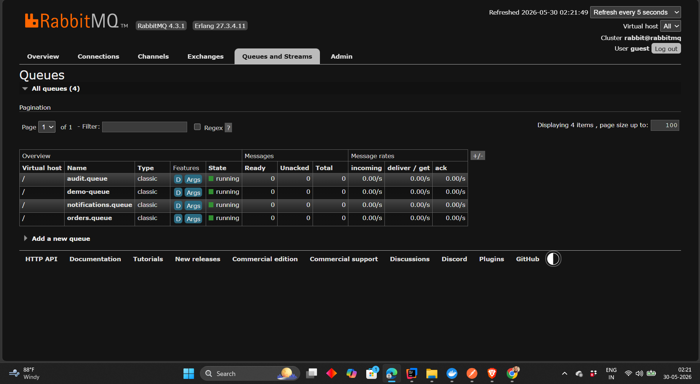
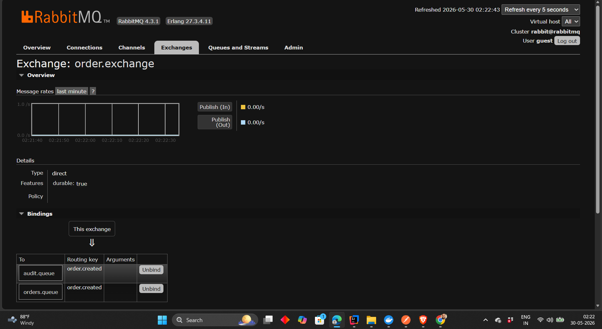
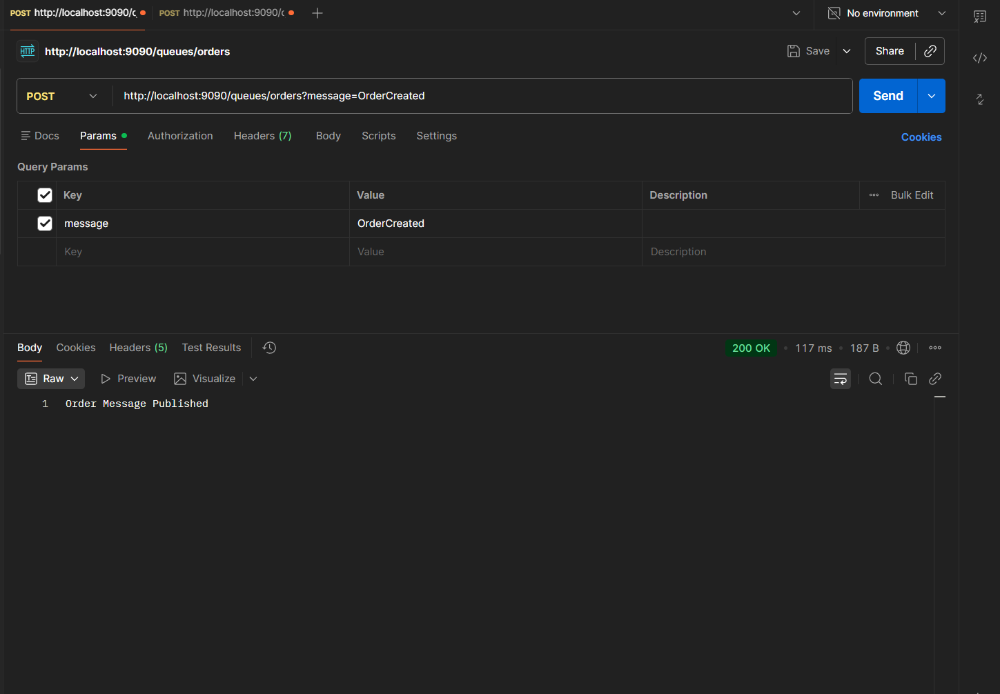
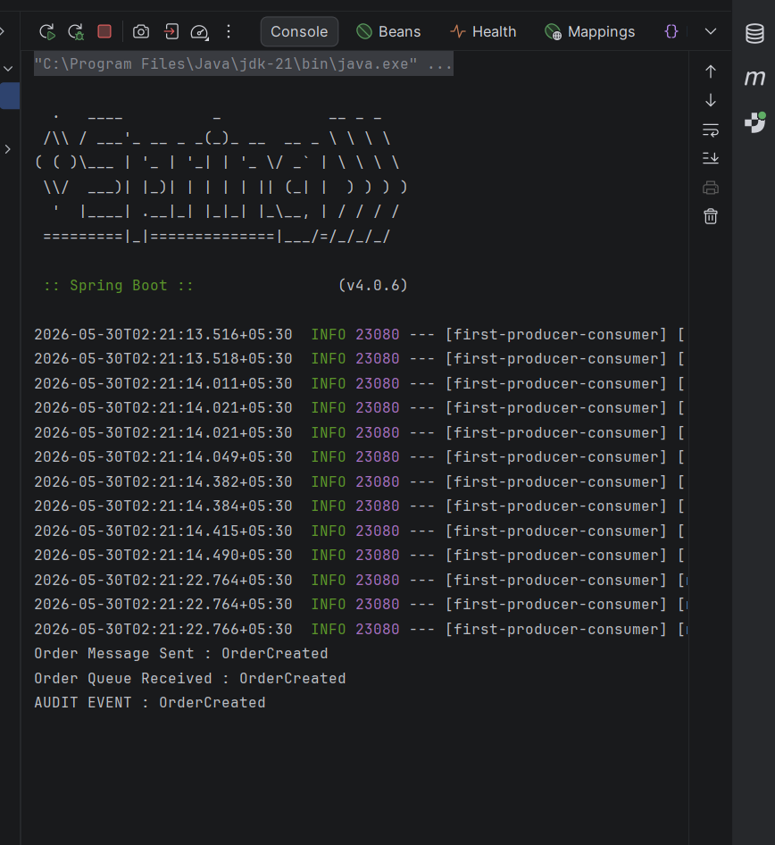

# Bindings Deep Dive

## Learning Objectives

After completing this chapter, you will understand:

* What a Binding is
* Why Bindings exist
* How Exchanges communicate with Queues
* What happens when no Binding exists
* One Exchange → One Queue
* One Exchange → Multiple Queues
* Multiple Bindings
* Binding Lifecycle
* Binding Best Practices
* How to configure Bindings using Spring Boot

---

# Recap From Previous Chapter

In the previous chapter, we learned:

```text
Producer
    |
    V

Exchange
    |
    V

Queue
    |
    V

Consumer
```

We also learned that:

* Exchanges route messages
* Queues store messages
* Consumers process messages

However, one important question remains:

> How does an Exchange know where a message should go?

The answer is:

```text
Binding
```

---

# What Is A Binding?

A Binding is a relationship between:

```text
Exchange
    |
Binding
    |
Queue
```

A Binding tells RabbitMQ:

> Messages matching certain criteria should be routed to a specific Queue.

Without Bindings, Exchanges cannot route messages.

---

# Why Do Bindings Exist?

Imagine an Exchange receives a message.

RabbitMQ now needs to answer:

```text
Which Queue should receive this message?
```

Without Bindings:

```text
RabbitMQ has no routing instructions.
```

Bindings provide those routing instructions.

---

# Exchange Without Binding


Consider the following scenario:

```text
Producer
    |
    V

order.exchange

(no binding)

orders.queue
```

The Exchange receives the message.

However:

```text
No Binding Exists
```

RabbitMQ cannot determine where the message should go.

Result:

```text
Message Dropped
```

This is one of the most common beginner mistakes.

---

# Binding Connects Exchange And Queue


A Binding acts like a bridge.

```text
Exchange
     |
 Binding
     |
Queue
```

The Binding instructs RabbitMQ:

```text
Send matching messages
to this Queue.
```

---

# Binding Lifecycle

Every Binding follows this lifecycle:

```text
Exchange Created
       |
       V

Queue Created
       |
       V

Binding Created
       |
       V

Messages Routed
       |
       V

Messages Consumed
```

Bindings are the routing instructions that connect Exchanges and Queues.

---

# One Exchange → One Queue

Simplest scenario:

```text
order.exchange
       |
(order.created)
       |
orders.queue
```

Whenever RabbitMQ receives:

```text
order.created
```

the message is routed to:

```text
orders.queue
```

This is the most common beginner setup.

---

# One Exchange → Multiple Queues

RabbitMQ becomes powerful when one Exchange serves multiple Queues.


Example:

```text
order.exchange
       |
       +------> orders.queue
       |
       +------> audit.queue
       |
       +------> analytics.queue
```

Now a single message can be distributed to multiple consumers.

---

# Why Is This Useful?

Consider an E-Commerce Platform.

When an order is created:

```text
Order Service
```

must process the order.

At the same time:

```text
Audit Service
```

must record the event.

And:

```text
Analytics Service
```

must update metrics.

Without Bindings:

```text
Complex Logic
```

With Bindings:

```text
RabbitMQ Handles Distribution
```

Automatically.

---

# Multiple Bindings Overview


A single Exchange can have many Bindings.

Example:

```text
order.exchange
      |
      +---- Binding A
      |
      +---- Binding B
      |
      +---- Binding C
```

Each Binding can route messages differently.

This flexibility makes RabbitMQ highly scalable.

---

# Practical Implementation

In this chapter we extended our application.

Previously:

```text
order.exchange
       |
(order.created)
       |
orders.queue
```

Now:

```text
order.exchange
       |
(order.created)
       |
       +------> orders.queue
       |
       +------> audit.queue
```

One message reaches two different consumers.

---

# Creating Audit Queue

Queue Configuration:

```java
@Bean
public Queue auditQueue() {
    return new Queue("audit.queue", true);
}
```

RabbitMQ automatically creates:

```text
audit.queue
```

during application startup.

---

# Creating Audit Binding

Binding Configuration:

```java
@Bean
public Binding auditBinding(
        Queue auditQueue,
        DirectExchange orderExchange
) {

    return BindingBuilder
            .bind(auditQueue)
            .to(orderExchange)
            .with("order.created");
}
```

This Binding instructs RabbitMQ:

```text
Messages with Routing Key

order.created

should also go to

audit.queue
```

---

# Multiple Bindings Configuration

RabbitMQ now contains:

```text
order.exchange
       |
(order.created)
       |
       +------> orders.queue
       |
       +------> audit.queue
```

Same Routing Key.

Multiple Queues.

Multiple Consumers.

---

# Verifying Audit Queue



RabbitMQ now shows:

```text
audit.queue
```

alongside:

```text
orders.queue
notifications.queue
```

---

# Verifying Multiple Bindings



Inside RabbitMQ:

```text
order.exchange
```

contains multiple bindings.

This confirms:

```text
One Exchange
      |
Multiple Queues
```

configuration.

---

# Publishing A Message

API Request:

```http
POST /queues/orders?message=OrderCreated
```

Response:

```text
Order Message Published
```

---



The Producer publishes a single message.

RabbitMQ handles the distribution automatically.

---

# One Message Multiple Consumers



Console Output:

```text
Order Message Sent : OrderCreated

Order Queue Received : OrderCreated

AUDIT EVENT : OrderCreated
```

This output is extremely important.

Notice:

```text
One Message
```

produced:

```text
Order Consumer Processing

AND

Audit Consumer Processing
```

at the same time.

---

# Understanding What Happened

Step 1:

```text
Producer
```

publishes:

```text
OrderCreated
```

---

Step 2:

RabbitMQ receives the message.

---

Step 3:

Exchange evaluates Bindings.

---

Step 4:

RabbitMQ discovers:

```text
orders.queue

audit.queue
```

both match.

---

Step 5:

Message is routed to both Queues.

---

Step 6:

Both Consumers process the event.

Result:

```text
One Event

Multiple Consumers
```

---

# Real World Example

Imagine Amazon receives:

```text
Order Created
```

event.

The event may need to be processed by:

```text
Order Service

Audit Service

Analytics Service

Notification Service

Inventory Service
```

Instead of each service calling every other service:

```text
Order Service
      |
RabbitMQ Exchange
      |
      +---- Audit Queue
      |
      +---- Analytics Queue
      |
      +---- Notification Queue
      |
      +---- Inventory Queue
```

RabbitMQ distributes events automatically.

This is Event-Driven Architecture.

---

# Binding Best Practices

## Use Meaningful Routing Keys

Good:

```text
order.created

order.updated

payment.completed
```

Bad:

```text
event1

event2
```

---

## Keep Bindings Business Focused

Good:

```text
orders.queue

audit.queue

notifications.queue
```

Bad:

```text
queue1

queue2
```

---

## Avoid Giant Exchanges

Separate domains:

```text
order.exchange

payment.exchange

inventory.exchange
```

instead of:

```text
application.exchange
```

---

## Monitor Binding Growth

Too many Bindings can make routing logic difficult to understand.

Keep Exchange responsibilities clear.

---

# Key Takeaways

* Bindings connect Exchanges and Queues.
* Exchanges cannot route messages without Bindings.
* One Exchange can have multiple Bindings.
* One message can reach multiple Queues.
* RabbitMQ distributes messages automatically.
* Bindings are the foundation of Event-Driven Architecture.
* Multiple services can react to the same event independently.

---

# Interview Questions

### 1. What is a Binding in RabbitMQ?

### 2. Why are Bindings required?

### 3. What happens if an Exchange has no Binding?

### 4. Can one Exchange have multiple Bindings?

### 5. Can one message reach multiple Queues?

### 6. What is the relationship between Exchanges and Queues?

### 7. How do Bindings work with Routing Keys?

### 8. Explain the Binding lifecycle.

### 9. What are Binding best practices?

### 10. Explain how RabbitMQ distributes one message to multiple consumers.

### 11. What role do Bindings play in Event-Driven Architecture?

### 12. Explain the complete message routing process.

---

# Chapter Summary

In this chapter, we explored Bindings, the routing relationships that connect Exchanges and Queues.

We learned:

* Why Bindings exist
* How Bindings work
* Exchange-to-Queue relationships
* One Exchange → Multiple Queues
* Multiple Bindings
* Real-world event distribution patterns

Most importantly, we learned how RabbitMQ enables:

```text
One Event
      ↓
Multiple Services
```

through Bindings.

This capability is one of the foundations of modern Event-Driven Systems and Microservice Architectures.

---

# What's Next?

### Next Chapter → Routing Keys

Topics Covered:

* What Is A Routing Key?
* Exact Matching
* Routing Decisions
* Direct Exchange Routing
* Routing Key Patterns
* Message Classification
* Routing Best Practices
* Spring Boot Routing Key Examples

```
```
