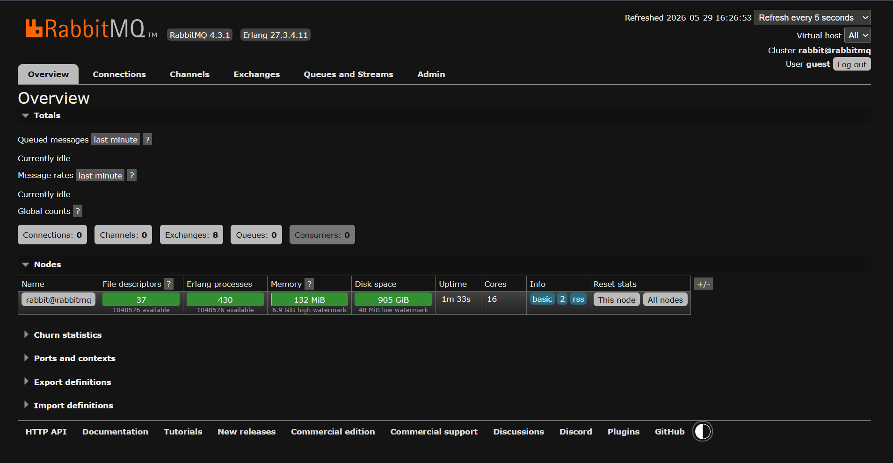
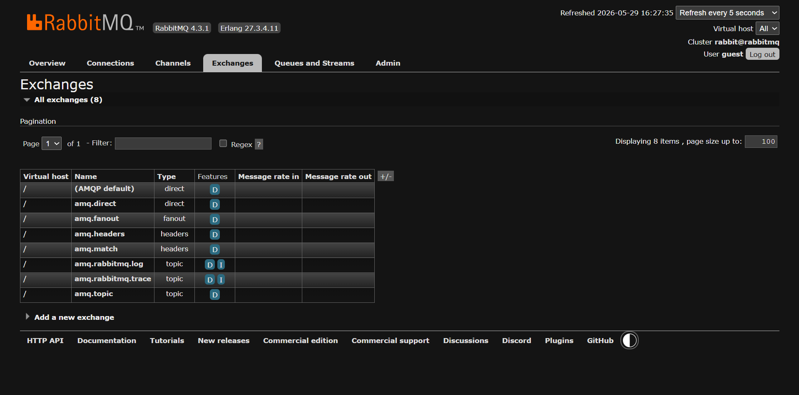
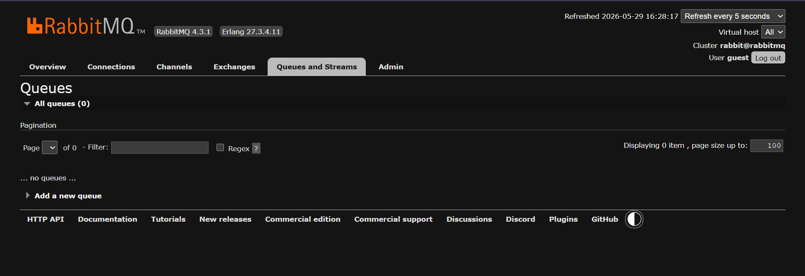
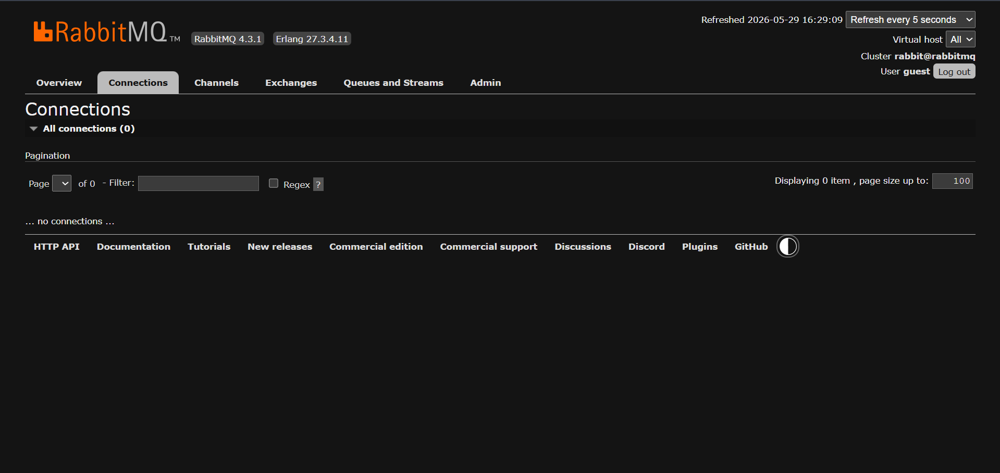
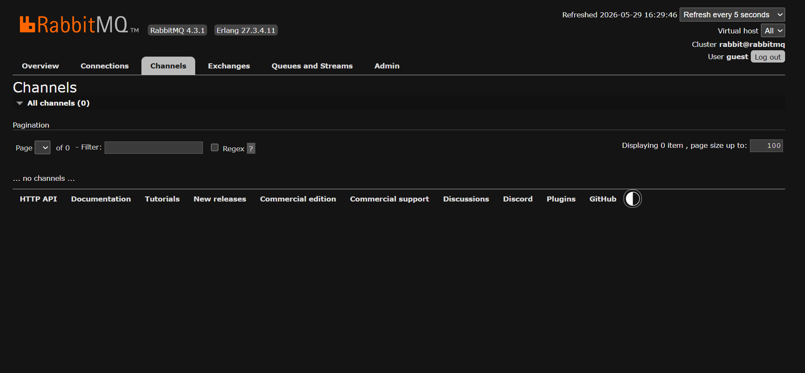
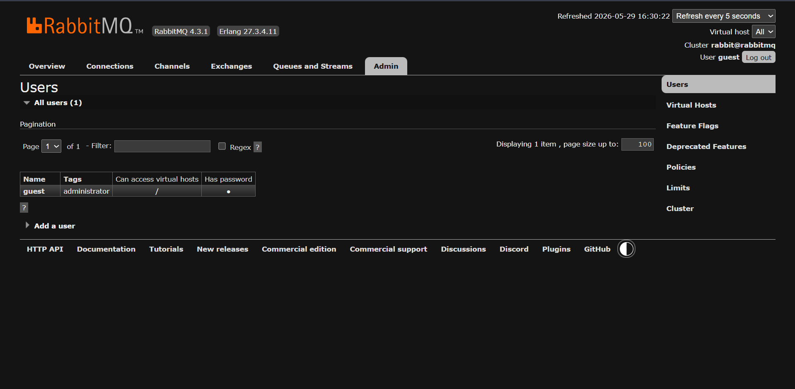

# Installing RabbitMQ & Exploring the Management UI

## Learning Objectives

After completing this chapter, you will be able to:

* Install RabbitMQ using Docker
* Run RabbitMQ locally
* Access the RabbitMQ Management UI
* Understand the purpose of Exchanges, Queues, Connections, and Channels
* Navigate the RabbitMQ Dashboard
* Verify that RabbitMQ is running correctly

---

# Why RabbitMQ Management UI Matters

RabbitMQ is not just a message broker.

It also provides a powerful web-based management interface that allows us to:

* Monitor queues
* Monitor exchanges
* View active connections
* View channels
* Manage users and permissions
* Publish messages manually
* Inspect message flow

The Management UI is one of the reasons RabbitMQ is developer-friendly.

As we progress through this tutorial series, we will use this dashboard extensively to visualize what is happening behind the scenes.

---

# Installing RabbitMQ

For this tutorial series, we will use Docker.

Using Docker provides several advantages:

* Easy setup
* Consistent environment
* No manual dependency management
* Easy cleanup and upgrades

---

# Pulling and Running RabbitMQ

Run the following command:

```bash
docker run -d ^
--hostname rabbitmq ^
--name rabbitmq ^
-p 5672:5672 ^
-p 15672:15672 ^
--restart unless-stopped ^
rabbitmq:management
```

## What Does This Command Do?

| Option                     | Purpose                               |
| -------------------------- | ------------------------------------- |
| `-d`                       | Run container in background           |
| `--hostname rabbitmq`      | Set RabbitMQ hostname                 |
| `--name rabbitmq`          | Container name                        |
| `-p 5672:5672`             | RabbitMQ AMQP Port                    |
| `-p 15672:15672`           | Management UI Port                    |
| `--restart unless-stopped` | Auto restart container                |
| `rabbitmq:management`      | RabbitMQ image with Management Plugin |

---

# Verifying Installation

Check running containers:

```bash
docker ps
```

Expected output:

```text
rabbitmq:management
```

RabbitMQ should be in the `Up` state.

---

# Accessing The Management UI

Open:

```text
http://localhost:15672
```

Default credentials:

```text
Username: guest
Password: guest
```

After successful login, you should see the RabbitMQ dashboard.

---

# RabbitMQ Dashboard Overview



The Overview page provides information about:

* RabbitMQ version
* Node information
* Queue statistics
* Exchange statistics
* Connection statistics
* Channel statistics

This page acts as the central monitoring dashboard.

---

# Understanding Exchanges

Navigate to:

```text
Exchanges
```



You will notice several exchanges already available.

Examples:

* amq.direct
* amq.fanout
* amq.topic
* amq.headers

These are built-in exchanges created by RabbitMQ.

Do not worry about them yet.

We will explore them in detail in later chapters.

---

# Understanding Queues

Navigate to:

```text
Queues and Streams
```



At this point, there are no queues available.

This is expected.

Queues will appear once applications start creating them.

A Queue is responsible for storing messages until Consumers process them.

---

# Understanding Connections

Navigate to:

```text
Connections
```



Currently, no active connections exist.

This is because no Producer or Consumer applications are connected.

A Connection represents a TCP connection between an application and RabbitMQ.

Examples:

* Java Application
* Spring Boot Application
* Python Application

Whenever an application connects to RabbitMQ, it creates a Connection.

---

# Understanding Channels

Navigate to:

```text
Channels
```



Currently, no channels exist.

This is expected.

Channels are lightweight communication paths created inside a Connection.

Instead of creating multiple TCP connections, applications create multiple Channels.

Benefits:

* Better performance
* Lower resource consumption
* Efficient communication

Most RabbitMQ operations happen through Channels.

---

# Understanding Users & Permissions

Navigate to:

```text
Admin
```



RabbitMQ supports authentication and authorization.

By default:

```text
Username: guest
Password: guest
```

RabbitMQ allows:

* Creating new users
* Assigning roles
* Managing permissions
* Restricting access

This becomes important in production environments.

---

# Important Ports

RabbitMQ uses multiple ports.

| Port  | Purpose               |
| ----- | --------------------- |
| 5672  | AMQP Communication    |
| 15672 | Management UI         |
| 25672 | Cluster Communication |

For local development, we primarily use:

```text
5672
15672
```

---

# Common Installation Issues

## Docker Not Running

Error:

```text
Cannot connect to Docker daemon
```

Solution:

Start Docker Desktop.

---

## Port Already In Use

Error:

```text
Bind for 0.0.0.0:5672 failed
```

Solution:

Check which process is using the port.

```bash
netstat -ano | findstr 5672
```

---

## Cannot Access Management UI

Verify container status:

```bash
docker ps
```

Verify port mapping:

```bash
docker port rabbitmq
```

Then open:

```text
http://localhost:15672
```

---

# Real-World Usage

In production environments, RabbitMQ is commonly deployed:

* Inside Docker Containers
* On Kubernetes Clusters
* As Part Of Microservice Architectures
* With Monitoring Tools

The Management UI is frequently used by developers and DevOps engineers to:

* Monitor queues
* Investigate failures
* Analyze message flow
* Debug consumer issues

---

# Key Takeaways

* RabbitMQ can be installed easily using Docker.
* The Management UI runs on port 15672.
* AMQP communication occurs on port 5672.
* Exchanges route messages.
* Queues store messages.
* Connections represent TCP connections.
* Channels provide lightweight communication paths.
* The Admin section manages users and permissions.

---

# Interview Questions

### 1. What port does RabbitMQ use?

### 2. What is the RabbitMQ Management UI?

### 3. How do you access the RabbitMQ dashboard?

### 4. What is the difference between a Connection and a Channel?

### 5. Why are Channels preferred over multiple Connections?

### 6. What are built-in exchanges?

### 7. What is the purpose of the Admin section?

### 8. How do you verify RabbitMQ is running?

### 9. Which Docker image provides the Management UI?

### 10. What is the purpose of port 15672?

---

# Chapter Summary

In this chapter, we installed RabbitMQ using Docker and explored the RabbitMQ Management UI.

We learned:

* How to run RabbitMQ locally
* How to access the dashboard
* How to navigate Exchanges, Queues, Connections, and Channels
* How RabbitMQ organizes users and permissions

This chapter establishes the environment that we will use throughout the rest of this repository.

---

# What's Next?

In the next chapter, we will create our first RabbitMQ application.

### Next Chapter → First Producer & Consumer

Topics Covered:

* RabbitMQ Java Client
* Creating Queues
* Publishing Messages
* Consuming Messages
* Observing Message Flow In RabbitMQ
* Understanding Producer & Consumer Communication
