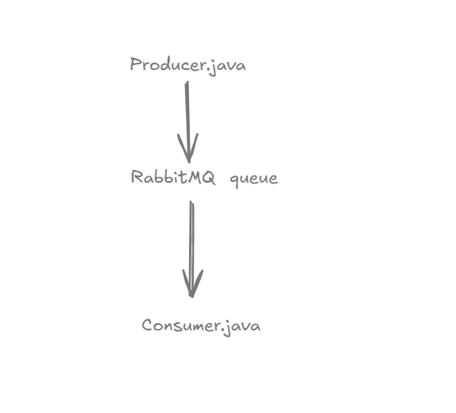
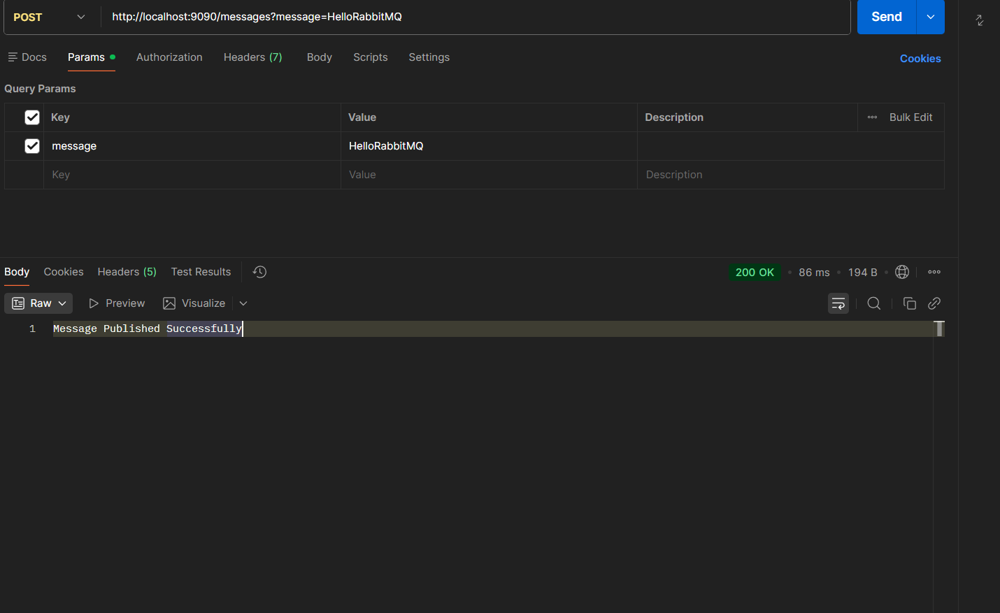
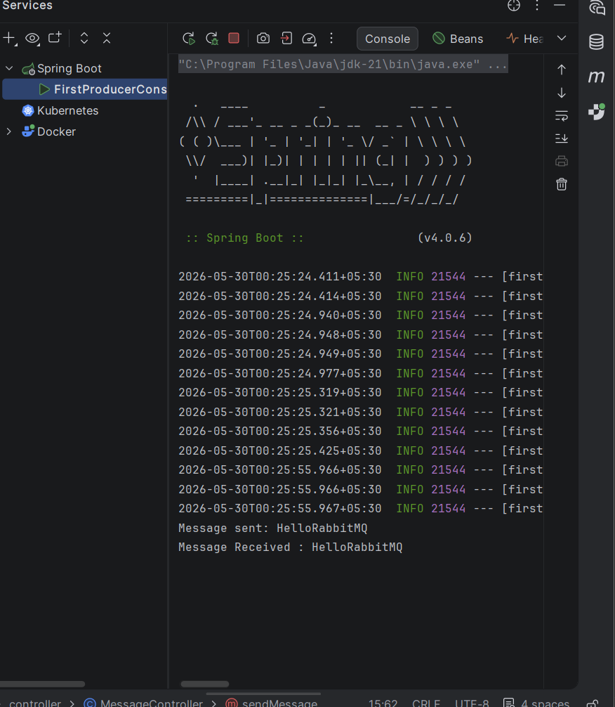
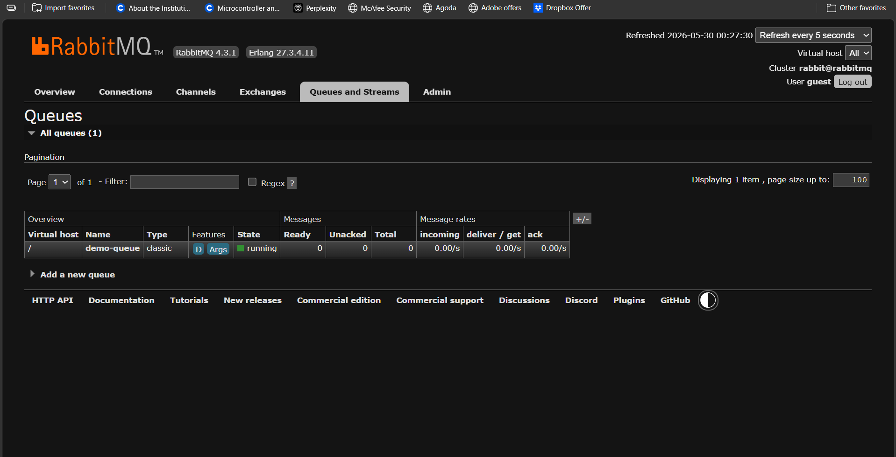
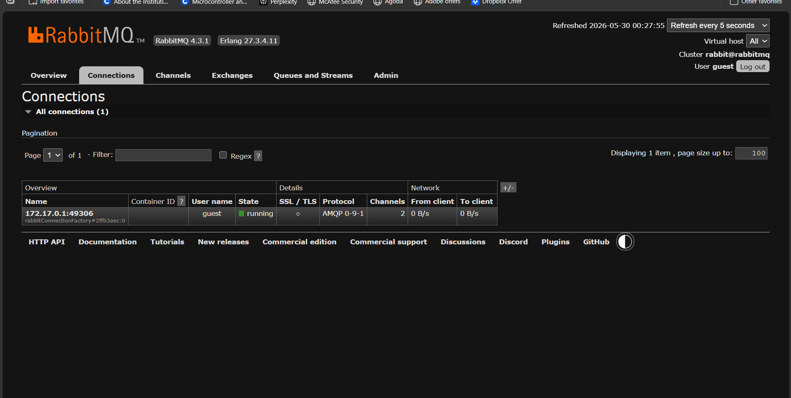
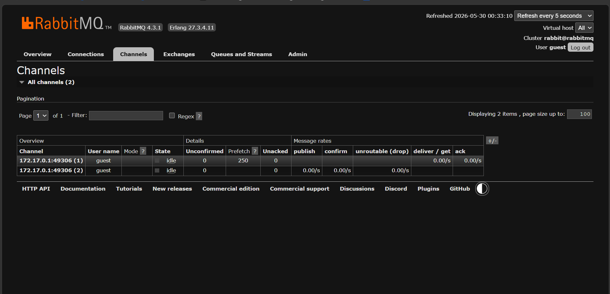
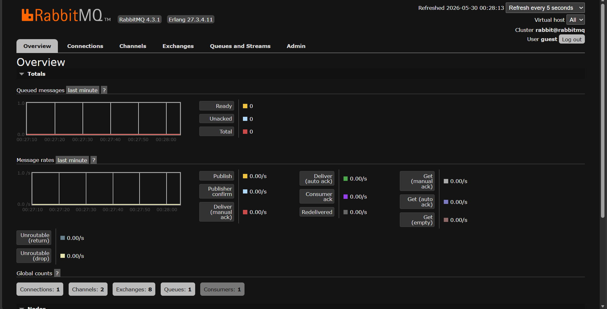

# First Producer & Consumer with Spring Boot and RabbitMQ

## Learning Objectives

After completing this chapter, you will be able to:

* Create your first RabbitMQ Queue
* Build a RabbitMQ Producer using Spring Boot
* Build a RabbitMQ Consumer using Spring Boot
* Publish messages to RabbitMQ
* Consume messages from RabbitMQ
* Observe RabbitMQ activity using the Management UI
* Understand the complete message flow from Producer to Consumer

---

# Why Producer & Consumer Matter

RabbitMQ revolves around two fundamental concepts:

## Producer

A Producer is responsible for sending messages.

Examples:

* Order Service
* Payment Service
* User Service

A Producer creates a message and publishes it to RabbitMQ.

---

## Consumer

A Consumer is responsible for receiving and processing messages.

Examples:

* Notification Service
* Analytics Service
* Inventory Service

Consumers listen for messages and process them when they arrive.

---

# Architecture Overview



Message Flow:

```text
REST API Request
       |
       V
Message Controller
       |
       V
Message Producer
       |
       V
RabbitMQ Queue
       |
       V
Message Consumer
       |
       V
Console Output
```

---

# Project Structure

```text
examples/
└── first-producer-consumer
    │
    ├── config
    │   └── RabbitMQConfig.java
    │
    ├── controller
    │   └── MessageController.java
    │
    ├── producer
    │   └── MessageProducer.java
    │
    ├── consumer
    │   └── MessageConsumer.java
    │
    ├── resources
    │   └── application.yml
    │
    └── FirstProducerConsumerApplication.java
```

---

# Maven Dependencies

The following dependencies are required.

```xml
<dependency>
    <groupId>org.springframework.boot</groupId>
    <artifactId>spring-boot-starter-amqp</artifactId>
</dependency>

<dependency>
    <groupId>org.springframework.boot</groupId>
    <artifactId>spring-boot-starter-web</artifactId>
</dependency>

<dependency>
    <groupId>org.projectlombok</groupId>
    <artifactId>lombok</artifactId>
</dependency>
```

---

# Configuring RabbitMQ

Create:

```text
application.yml
```

```yaml
spring:
  rabbitmq:
    host: localhost
    port: 5672
    username: guest
    password: guest
```

These properties allow Spring Boot to connect to RabbitMQ.

---

# Creating The Queue

Create:

```java
RabbitMQConfig.java
```

```java
@Configuration
public class RabbitMQConfig {

    public static final String QUEUE_NAME = "demo.queue";

    @Bean
    public Queue queue() {
        return new Queue(QUEUE_NAME);
    }
}
```

## What Is Happening Here?

We are creating a Queue named:

```text
demo.queue
```

When Spring Boot starts, RabbitMQ automatically creates this queue if it does not already exist.

This queue will temporarily store messages until Consumers process them.

---

# Creating The Producer

Create:

```java
MessageProducer.java
```

```java
@Service
@RequiredArgsConstructor
public class MessageProducer {

    private final RabbitTemplate rabbitTemplate;

    public void sendMessage(String message) {

        rabbitTemplate.convertAndSend(
                RabbitMQConfig.QUEUE_NAME,
                message
        );

        System.out.println("Message Sent : " + message);
    }
}
```

---

# Understanding The Producer

The Producer uses:

```java
RabbitTemplate
```

which is Spring Boot's abstraction over RabbitMQ communication.

When:

```java
convertAndSend(...)
```

is called:

1. Message is converted
2. Message is published
3. RabbitMQ receives the message
4. Message is stored in the Queue

---

# Creating The Consumer

Create:

```java
MessageConsumer.java
```

```java
@Service
public class MessageConsumer {

    @RabbitListener(
            queues = RabbitMQConfig.QUEUE_NAME
    )
    public void receiveMessage(String message) {

        System.out.println(
                "Message Received : " + message
        );
    }
}
```

---

# Understanding The Consumer

The annotation:

```java
@RabbitListener
```

tells Spring Boot:

> Continuously listen to this queue.

Whenever a new message arrives:

```text
demo.queue
```

Spring automatically invokes:

```java
receiveMessage(...)
```

This is one of the biggest advantages of Spring AMQP.

We do not need to manually poll RabbitMQ.

---

# Creating The REST Endpoint

Create:

```java
MessageController.java
```

```java
@RestController
@RequestMapping("/messages")
@RequiredArgsConstructor
public class MessageController {

    private final MessageProducer producer;

    @PostMapping
    public String sendMessage(
            @RequestParam String message
    ) {

        producer.sendMessage(message);

        return "Message Published Successfully";
    }
}
```

---

# Why Create A REST API?

Without a REST endpoint:

```text
Client
   |
   X
```

there would be no easy way to publish messages.

The REST API acts as an entry point.

Flow:

```text
Client
    |
HTTP Request
    |
Controller
    |
Producer
    |
RabbitMQ
```

---

# Running The Application

Start RabbitMQ:

```bash
docker start rabbitmq
```

Run Spring Boot:

```bash
mvn spring-boot:run
```

Wait until the application starts successfully.

---

# Testing The Application

Using Postman:

```http
POST http://localhost:9090/messages?message=HelloRabbitMQ
```

Expected Response:

```text
Message Published Successfully
```

---

# API Request



The API successfully publishes a message to RabbitMQ.

---

# Console Output



Producer Output:

```text
Message Sent : HelloRabbitMQ
```

Consumer Output:

```text
Message Received : HelloRabbitMQ
```

This confirms that RabbitMQ successfully transferred the message.

---

# Observing RabbitMQ

Open:

```text
http://localhost:15672
```

Login:

```text
Username: guest
Password: guest
```

---

# Queue Created



Notice:

```text
demo.queue
```

RabbitMQ automatically created the queue.

---

# Active Connection



RabbitMQ now shows an active connection.

This connection was created by Spring Boot.

---

# Active Channel



RabbitMQ also created channels.

Channels are lightweight communication paths inside a Connection.

Most RabbitMQ operations happen through Channels.

---

# RabbitMQ Overview



The dashboard now shows activity generated by our application.

This proves RabbitMQ is actively processing messages.

---

# Complete Message Flow

Let's trace what happened internally.

### Step 1

Client sends:

```http
POST /messages
```

### Step 2

Controller receives the request.

### Step 3

Controller invokes Producer.

### Step 4

Producer publishes message.

### Step 5

RabbitMQ receives message.

### Step 6

RabbitMQ stores message inside:

```text
demo.queue
```

### Step 7

Consumer retrieves message.

### Step 8

Consumer processes message.

### Step 9

Message is removed from Queue.

---

# Key Takeaways

* Producers publish messages.
* Consumers process messages.
* Queues temporarily store messages.
* RabbitTemplate simplifies RabbitMQ communication.
* RabbitListener automatically consumes messages.
* Spring Boot integrates seamlessly with RabbitMQ.
* RabbitMQ Management UI helps visualize message flow.

---

# Interview Questions

### 1. What is a Producer?

### 2. What is a Consumer?

### 3. What is RabbitTemplate?

### 4. What is RabbitListener?

### 5. What happens when convertAndSend() is called?

### 6. How is a Queue created in Spring Boot?

### 7. What is the role of RabbitMQConfig?

### 8. How does Spring Boot connect to RabbitMQ?

### 9. What is the difference between a Queue and a Consumer?

### 10. Explain the complete message flow.

---

# Chapter Summary

In this chapter, we built our first RabbitMQ application using Spring Boot.

We created:

* Queue
* Producer
* Consumer
* REST API

We then published a message, observed RabbitMQ processing it, and verified the complete flow using the RabbitMQ Management UI.

This is the foundation for everything that follows in RabbitMQ.

---

# What's Next?

### Next Chapter → Queues Deep Dive

Topics Covered:

* Queue Properties
* Durable Queues
* Temporary Queues
* Auto Delete Queues
* Exclusive Queues
* Queue Lifecycle
* Queue Best Practices
* Queue Design Considerations
