# Direct Exchange Deep Dive

## Learning Objectives

After completing this chapter, you will understand:

* What a Direct Exchange is
* Why Direct Exchanges exist
* Exact Match Routing
* Direct Exchange Message Flow
* Multiple Routing Keys
* Multiple Queues
* Routing Failures
* Real-World Use Cases
* Direct Exchange Best Practices
* Production-Grade Design Considerations

---

# Recap From Previous Chapters

So far we have learned:

```text
Producer
    |
Routing Key
    |
    V

Exchange
    |
 Binding
    |
    V

Queue
    |
    V

Consumer
```

We also learned:

* Exchanges route messages
* Bindings connect Exchanges and Queues
* Routing Keys determine routing behavior

Now it's time to understand the most commonly used Exchange type in RabbitMQ:

```text
Direct Exchange
```

---

# What Is A Direct Exchange?

A Direct Exchange routes messages using:

```text
Exact Match Routing
```

RabbitMQ compares:

```text
Routing Key
```

with:

```text
Binding Key
```

If both values match exactly:

```text
Message Delivered
```

Otherwise:

```text
Message Dropped
```

---

# Direct Exchange Overview

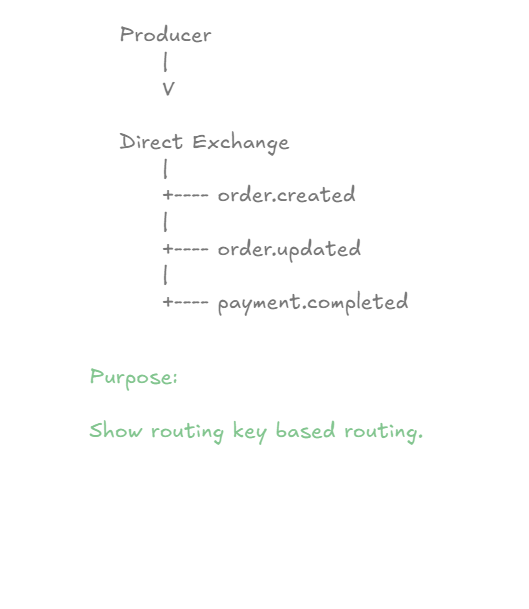

A Direct Exchange behaves like a smart router.

Example:

```text
order.created
order.updated
payment.completed
```

Each Routing Key can be routed to different Queues.

---

# Why Do We Need Direct Exchanges?

Imagine an E-Commerce platform.

Different events represent different business actions.

Examples:

```text
order.created

order.updated

order.cancelled

payment.completed

inventory.low
```

Sending all events to the same Queue would create chaos.

Direct Exchanges solve this problem.

---

# Exact Match Routing

The most important concept in Direct Exchanges:

```text
Routing Key
      =
Binding Key
```

must match exactly.

---

# Exact Match Example

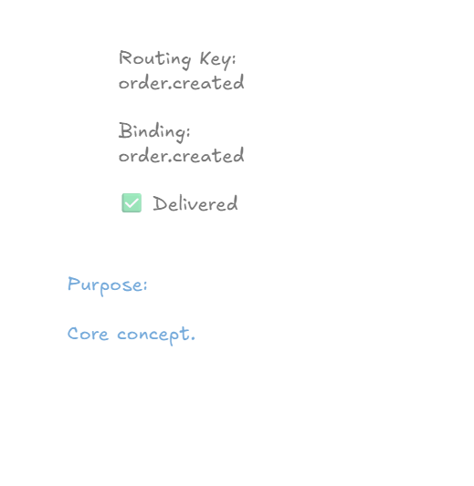

Example:

```text
Routing Key:
order.created

Binding Key:
order.created
```

Result:

```text
MATCH
```

RabbitMQ routes the message.

---

# Routing Failure

Direct Exchanges are strict.

No match means:

```text
No Delivery
```

---

# Routing Failure Example

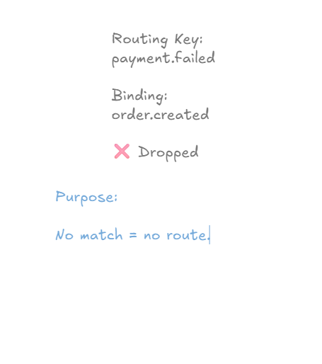

Example:

```text
Routing Key:
payment.failed

Binding Key:
order.created
```

Result:

```text
NO MATCH
```

RabbitMQ does not deliver the message.

---

# Direct Exchange Message Flow

Message journey:

```text
Producer
     |
     V

Direct Exchange
     |
     V

Binding Evaluation
     |
     V

Queue
     |
     V

Consumer
```

Every message passes through this process.

---

# Multiple Queues With Direct Exchange

A Direct Exchange can route a message to multiple Queues.

---

# Direct Exchange Multiple Queues

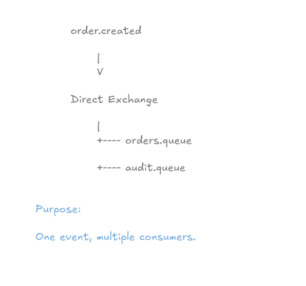

Example:

```text
Routing Key:
order.created
```

Matching Queues:

```text
orders.queue

audit.queue
```

Result:

```text
Both Queues Receive The Message
```

---

# Practical Implementation

In this chapter we expanded our Direct Exchange implementation.

Previously:

```text
order.created
order.updated
```

Now we added:

```text
order.cancelled
```

and:

```text
cancelled.queue
```

---

# Final Architecture

```text
order.exchange

       |
       +---- order.created
       |          |
       |          +---- orders.queue
       |          |
       |          +---- audit.queue
       |
       +---- order.updated
       |          |
       |          +---- updates.queue
       |
       +---- order.cancelled
                  |
                  +---- cancelled.queue
```

This architecture demonstrates how Direct Exchanges perform exact-match routing.

---

# Creating Cancelled Queue

Queue Configuration:

```java
@Bean
public Queue cancelledQueue() {
    return new Queue(
            "cancelled.queue",
            true
    );
}
```

RabbitMQ creates:

```text
cancelled.queue
```

during startup.

---

# Creating Routing Key

Exchange Configuration:

```java
public static final String ORDER_CANCELLED_KEY =
        "order.cancelled";
```

This Routing Key represents:

```text
Order Cancelled Event
```

---

# Creating Binding

```java
@Bean
public Binding cancelledBinding(
        Queue cancelledQueue,
        DirectExchange orderExchange
) {

    return BindingBuilder
            .bind(cancelledQueue)
            .to(orderExchange)
            .with(ORDER_CANCELLED_KEY);
}
```

RabbitMQ now knows:

```text
order.cancelled
       ↓
cancelled.queue
```

---

# Cancelled Event Consumer

```java
@RabbitListener(
        queues = QueueConfig.CANCELLED_QUEUE
)
public void consumeCancelledMessage(
        String message
) {

    System.out.println(
            "CANCELLED EVENT : " + message
    );
}
```

This Consumer processes cancellation events only.

---

# RabbitMQ Queue Verification

## Cancelled Queue Created

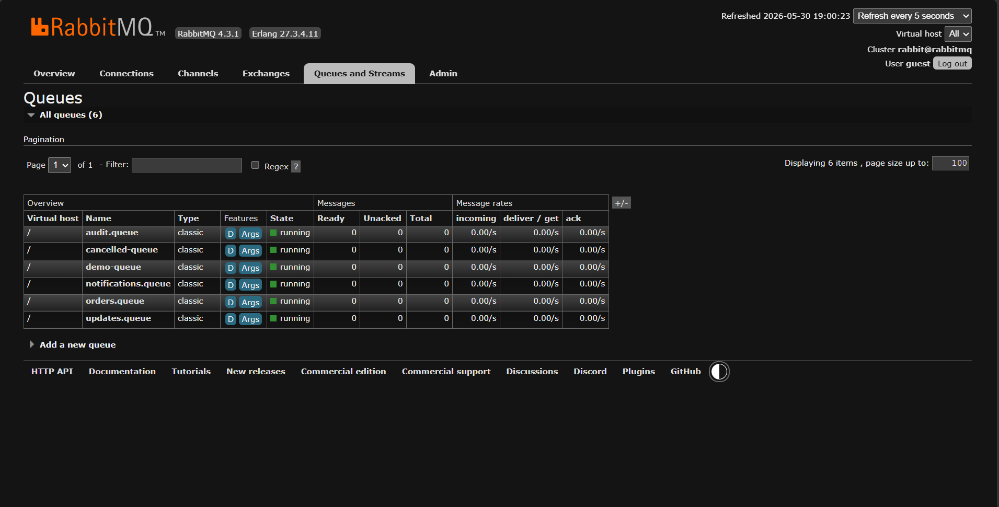

RabbitMQ now contains:

```text
orders.queue
audit.queue
updates.queue
cancelled.queue
```

---

# Testing Order Created Event

API:

```http
POST /queues/orders?message=OrderCreated
```

Response:

```text
Order Message Published
```

---

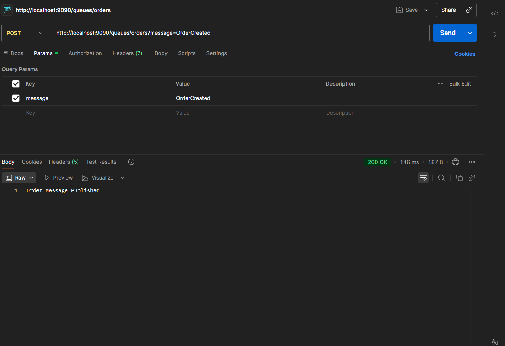

Routing Key:

```text
order.created
```

RabbitMQ routes the message to:

```text
orders.queue

audit.queue
```

---

# Testing Order Updated Event

API:

```http
POST /queues/orders/update?message=OrderUpdated
```

Response:

```text
Order Update Published
```

---

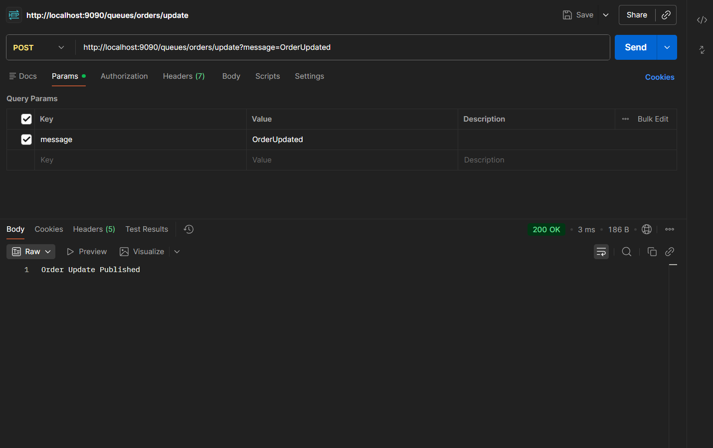

Routing Key:

```text
order.updated
```

RabbitMQ routes the message to:

```text
updates.queue
```

---

# Testing Order Cancelled Event

API:

```http
POST /queues/orders/cancel?message=OrderCancelled
```

Response:

```text
Order Cancelled Event Published
```

---

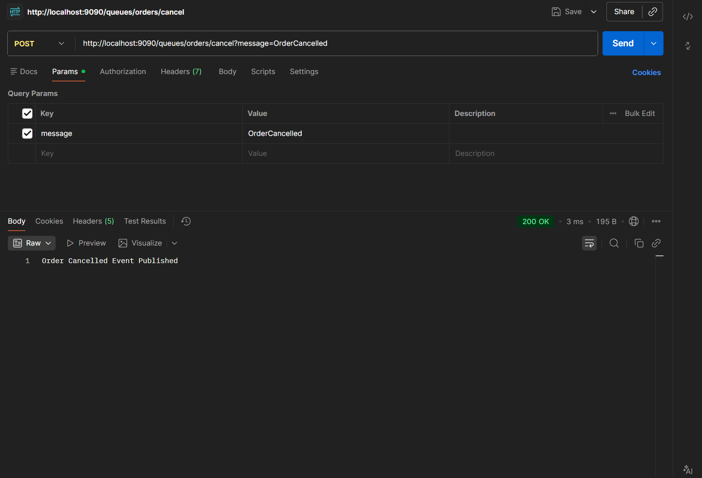

Routing Key:

```text
order.cancelled
```

RabbitMQ routes the message to:

```text
cancelled.queue
```

---

# Exchange Bindings Verification

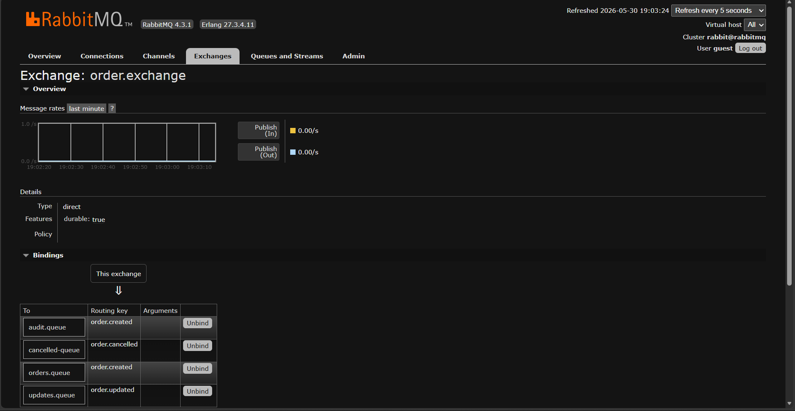

RabbitMQ shows:

```text
order.created
       |
       +---- orders.queue

       +---- audit.queue

order.updated
       |
       +---- updates.queue

order.cancelled
       |
       +---- cancelled.queue
```

This proves Direct Exchange routing behavior.

---

# Consumer Verification

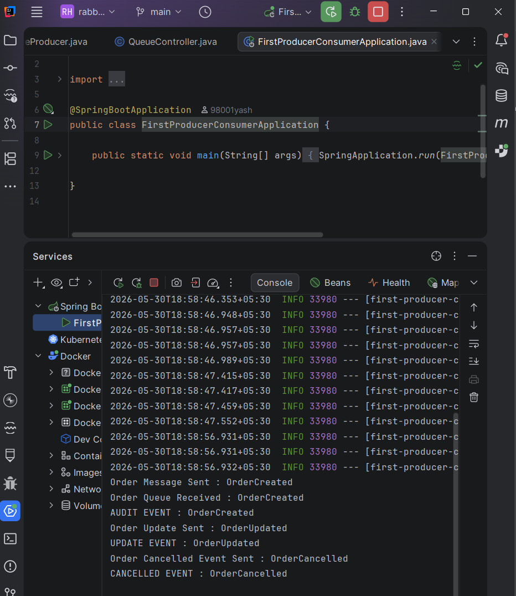

Console Output:

```text
Order Queue Received : OrderCreated

AUDIT EVENT : OrderCreated

UPDATE EVENT : OrderUpdated

CANCELLED EVENT : OrderCancelled
```

This demonstrates:

```text
Different Routing Keys

↓

Different Consumers
```

---

# Real World Example

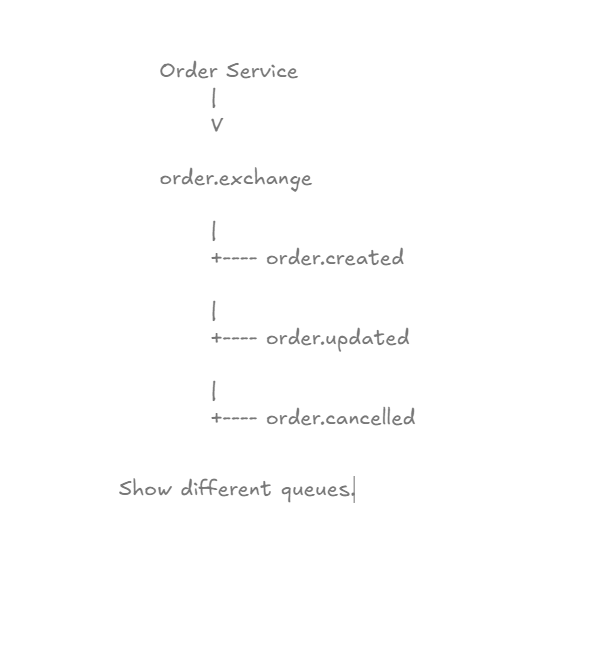

Consider an E-Commerce Platform.

Events:

```text
order.created

order.updated

order.cancelled
```

Consumers:

```text
Order Service

Audit Service

Inventory Service

Notification Service
```

RabbitMQ uses Routing Keys to deliver the right event to the right service.

---

# Production Use Cases

Direct Exchanges are commonly used for:

### Order Processing

```text
order.created
order.updated
order.cancelled
```

### Payment Systems

```text
payment.completed
payment.failed
payment.refunded
```

### Inventory Management

```text
inventory.low
inventory.restocked
inventory.updated
```

### Shipping Systems

```text
shipment.created
shipment.dispatched
shipment.delivered
```

---

# Direct Exchange Best Practices

## Use Clear Routing Keys

Good:

```text
order.created
order.updated
payment.completed
```

Bad:

```text
event1
test
abc
```

---

## Use Business-Oriented Naming

Recommended:

```text
domain.action
```

Examples:

```text
order.created
payment.completed
shipment.delivered
```

---

## Keep Exchanges Focused

Good:

```text
order.exchange
payment.exchange
inventory.exchange
```

Avoid:

```text
application.exchange
```

that handles everything.

---

## Document Routing Keys

Maintain an event catalog:

```text
Routing Key

Producer

Consumer

Description
```

This becomes essential in large microservice architectures.

---

# Limitations Of Direct Exchange

Direct Exchanges support:

```text
Exact Matching Only
```

They do NOT support:

```text
Wildcards

Pattern Matching

Complex Routing Rules
```

For those requirements:

```text
Topic Exchange
```

is a better choice.

---

# Key Takeaways

* Direct Exchange uses exact-match routing.
* Routing Key must match Binding Key.
* One Routing Key can route to multiple Queues.
* Different Routing Keys can route to different Queues.
* Direct Exchanges are the most commonly used Exchange type.
* They are ideal for business-event routing.
* They are simple, predictable, and highly efficient.

---

# Interview Questions

### 1. What is a Direct Exchange?

### 2. How does a Direct Exchange route messages?

### 3. What is Exact Match Routing?

### 4. What happens when Routing Key and Binding Key do not match?

### 5. Can one Routing Key route to multiple Queues?

### 6. Can a Direct Exchange have multiple Routing Keys?

### 7. What are the limitations of Direct Exchanges?

### 8. What are common production use cases?

### 9. Explain Direct Exchange message flow.

### 10. When would you choose Topic Exchange instead?

---

# Chapter Summary

In this chapter, we explored Direct Exchanges in depth.

We learned:

* Direct Exchange fundamentals
* Exact Match Routing
* Routing Success & Failure
* Multiple Queues
* Multiple Routing Keys
* Real-world use cases
* Production best practices

Most importantly, we demonstrated how RabbitMQ routes business events using exact Routing Key matching.

```text
Producer
    |
Routing Key
    |
    V

Direct Exchange
    |
 Binding Match
    |
    V

Queue
    |
    V

Consumer
```

This routing model powers many production systems built using RabbitMQ.

---

# What's Next?

## Next Chapter → Fanout Exchange

Topics Covered:

* What Is A Fanout Exchange?
* Broadcasting Messages
* One Message → Multiple Queues
* Ignoring Routing Keys
* Notification Systems
* Event Broadcasting
* Real-Time Systems
* Production Use Cases
