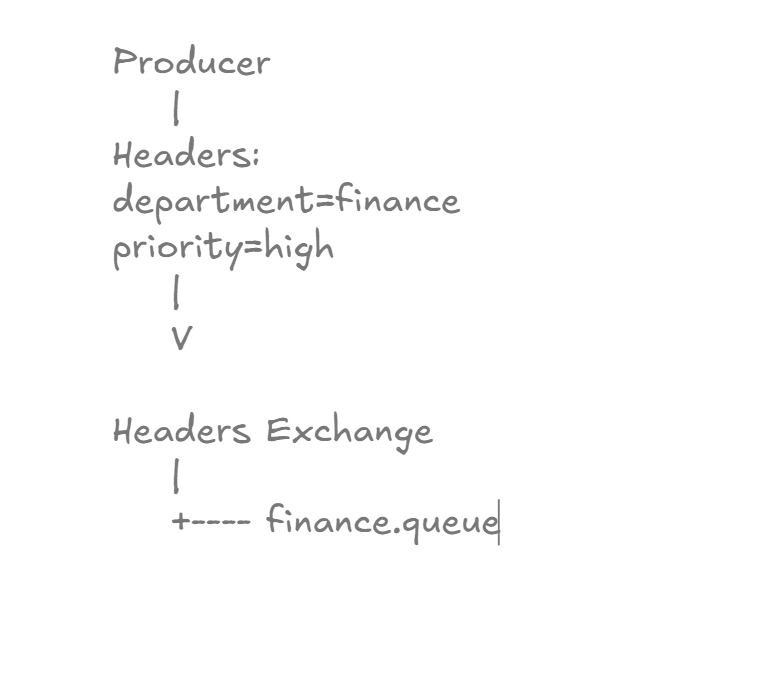
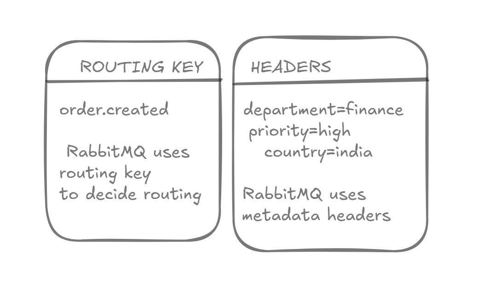
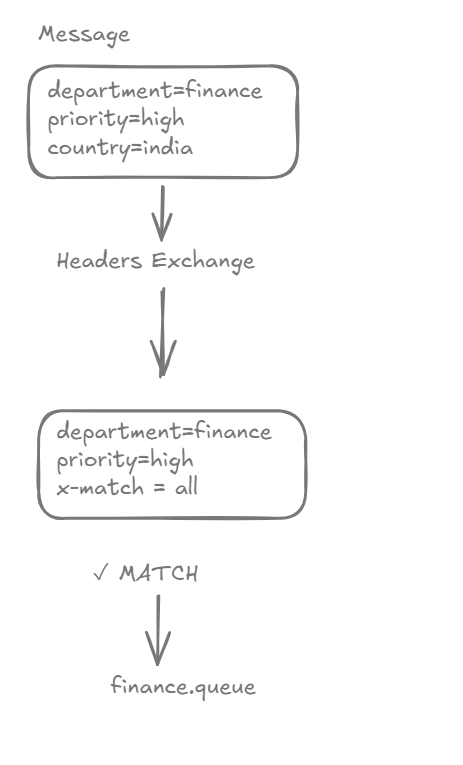
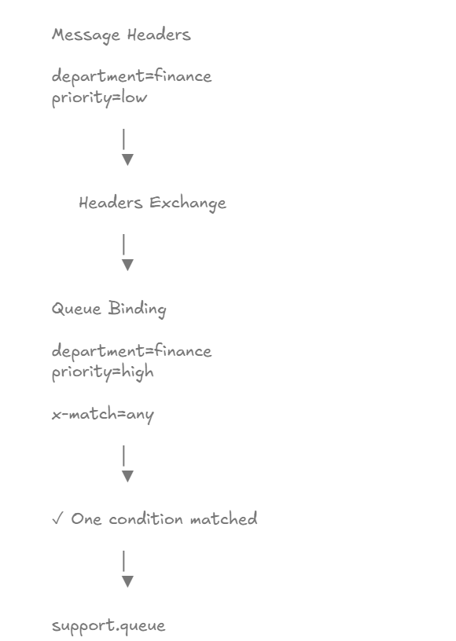
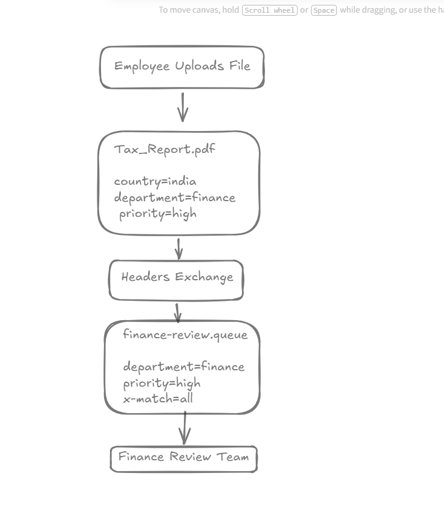

# Headers Exchange Deep Dive

## Learning Objectives

After completing this chapter, you will understand:

* What a Headers Exchange is
* Why Headers Exchanges exist
* Header-Based Routing
* Difference Between Routing Keys and Headers
* x-match = all
* x-match = any
* Enterprise Routing Strategies
* Spring Boot Headers Exchange Implementation
* Real-World Use Cases
* Production Best Practices

---

# Recap From Previous Chapters

RabbitMQ supports four major exchange types:

| Exchange Type    | Routing Strategy  |
| ---------------- | ----------------- |
| Direct Exchange  | Exact Match       |
| Fanout Exchange  | Broadcast         |
| Topic Exchange   | Pattern Matching  |
| Headers Exchange | Metadata Matching |

Unlike Direct, Fanout, and Topic Exchanges:

```text
Headers Exchange
DOES NOT USE
Routing Keys
```

Instead, it routes messages using:

```text
Message Headers
```

---

# What Is A Headers Exchange?

A Headers Exchange routes messages based on metadata stored inside message headers.

Example:

```text
department = finance
priority = high
country = india
```

RabbitMQ examines these headers and decides which queue should receive the message.

---

# Headers Exchange Overview



Message Flow:

```text
Producer
     |
Headers
     |
     V

Headers Exchange
     |
     +---- finance.queue
```

Routing decisions are based entirely on headers.

---

# Routing Key vs Headers



| Routing Key Based | Header Based         |
| ----------------- | -------------------- |
| Direct Exchange   | Headers Exchange     |
| Topic Exchange    | Headers Exchange     |
| Uses Routing Key  | Uses Message Headers |
| String Matching   | Metadata Matching    |
| Simple Routing    | Advanced Routing     |

---

# Why Headers Exchange Exists

Consider a banking system.

A transaction contains:

```text
department = finance
priority = high
region = india
```

Using routing keys for this becomes difficult and hard to maintain.

Headers Exchanges allow RabbitMQ to route directly using metadata.

---

# x-match = all

When:

```text
x-match = all
```

RabbitMQ requires:

```text
ALL HEADERS
TO MATCH
```

---

## Example

Message:

```text
department = finance
priority = high
country = india
```

Binding:

```text
department = finance
priority = high
x-match = all
```

Result:

```text
MATCH
```

---

# x-match = all Example



Every required condition must match.

---

# x-match = any

When:

```text
x-match = any
```

RabbitMQ requires:

```text
AT LEAST ONE
HEADER TO MATCH
```

---

## Example

Message:

```text
department = finance
priority = low
```

Binding:

```text
department = finance
priority = high
x-match = any
```

Result:

```text
MATCH
```

because one condition matched.

---

# x-match = any Example



This routing strategy is more flexible.

---

# Real World Document Routing



Example:

```text
Document Upload

country = india
department = finance
priority = high
```

RabbitMQ routes the document to:

```text
finance-review.queue
```

based entirely on metadata.

---

# Practical Implementation

In this chapter we implemented:

```text
business.headers.exchange
```

and created:

```text
finance.queue
support.queue
```

---

# Final Architecture

```text
business.headers.exchange

      |
      +---- finance.queue
      |          |
      |          +---- department=finance
      |          +---- priority=high
      |          +---- x-match=all
      |
      +---- support.queue
                 |
                 +---- department=support
                 +---- priority=high
                 +---- x-match=any
```

---

# Creating Headers Exchange

```java
@Bean
public HeadersExchange headersExchange() {
    return new HeadersExchange(
            "business.headers.exchange"
    );
}
```

---

# Creating Queues

```java
@Bean
public Queue financeQueue() {
    return new Queue(
            "finance.queue",
            true
    );
}

@Bean
public Queue supportQueue() {
    return new Queue(
            "support.queue",
            true
    );
}
```

---

# Finance Queue Binding

```java
Map<String, Object> headers =
        new HashMap<>();

headers.put("department", "finance");
headers.put("priority", "high");

return BindingBuilder
        .bind(financeQueue)
        .to(headersExchange)
        .whereAll(headers)
        .match();
```

This creates:

```text
x-match = all
```

---

# Support Queue Binding

```java
Map<String, Object> headers =
        new HashMap<>();

headers.put("department", "support");
headers.put("priority", "high");

return BindingBuilder
        .bind(supportQueue)
        .to(headersExchange)
        .whereAny(headers)
        .match();
```

This creates:

```text
x-match = any
```

---

# Creating Consumers

## Finance Consumer

```java
@RabbitListener(
        queues = "finance.queue"
)
public void consumeFinance(
        String message
) {

    System.out.println(
            "FINANCE EVENT : "
                    + message
    );
}
```

---

## Support Consumer

```java
@RabbitListener(
        queues = "support.queue"
)
public void consumeSupport(
        String message
) {

    System.out.println(
            "SUPPORT EVENT : "
                    + message
    );
}
```

---

# Exchange Verification

## Headers Exchange Created


---

## Finance Queue Created


---

## Support Queue Created


---

# Binding Verification


RabbitMQ shows:

```text
finance.queue

department = finance
priority = high

x-match = all
```

and

```text
support.queue

department = support
priority = high

x-match = any
```

---

# Testing Finance Message

API:

```http
POST /messages/headers/finance?message=BudgetApproved
```

Response:

```text
Finance Message Published Successfully
```


---

# Testing Support Message

API:

```http
POST /messages/headers/support?message=TicketCreated
```

Response:

```text
Support Message Published Successfully
```


---

# Consumer Verification


Console Output:

```text
FINANCE EVENT : BudgetApproved

SUPPORT EVENT : TicketCreated
```

This proves that header-based routing is functioning correctly.

---

# Production Use Cases

### Banking Systems

```text
department
priority
region
```

### Insurance Platforms

```text
claimType
priority
country
```

### Enterprise Document Processing

```text
department
approvalLevel
region
```

### Government Systems

```text
state
department
classification
```

---

# Headers Exchange Best Practices

## Use Headers Exchanges Sparingly

Prefer:

```text
Direct Exchange
Topic Exchange
```

for most applications.

Use Headers Exchange only when routing depends on metadata.

---

## Keep Header Names Consistent

Good:

```text
department
priority
region
```

Bad:

```text
dept
d
x
```

---

## Avoid Too Many Headers

Too many routing conditions make systems difficult to maintain.

---

## Document Routing Rules

Always document:

* Headers
* Allowed Values
* x-match Mode
* Consumers

---

# Interview Questions

1. What is a Headers Exchange?
2. How does it differ from Topic Exchange?
3. What is x-match = all?
4. What is x-match = any?
5. Why are Routing Keys ignored?
6. When should Headers Exchanges be used?
7. What are common enterprise use cases?
8. What are the drawbacks of Headers Exchanges?
9. How does RabbitMQ evaluate headers?
10. Explain metadata-based routing.

---

# Key Takeaways

* Headers Exchange routes messages using metadata.
* Routing Keys are ignored.
* x-match = all requires every condition to match.
* x-match = any requires at least one condition to match.
* Headers Exchanges provide flexible routing capabilities.
* They are mostly used in enterprise integration systems.

---

# Chapter Summary

In this chapter, we explored Headers Exchanges.

We learned:

* Metadata-Based Routing
* Routing Without Routing Keys
* x-match = all
* x-match = any
* Spring Boot Implementation
* Enterprise Routing Strategies
* Production Best Practices

Most importantly, we demonstrated:

```text
Message Headers
      ↓
Headers Exchange
      ↓
Header Matching
      ↓
Correct Queue
      ↓
Correct Consumer
```

This completes RabbitMQ's four major exchange types:

```text
✅ Direct Exchange
✅ Fanout Exchange
✅ Topic Exchange
✅ Headers Exchange
```

---

# What's Next?

## Chapter 14 → Message Acknowledgements

Topics Covered:

* Auto Acknowledgements
* Manual Acknowledgements
* Message Reliability
* Message Loss Prevention
* Consumer Safety
* At-Least-Once Delivery

This is where we begin RabbitMQ Production & Reliability concepts.
