# Dead Letter Exchanges (DLX)

## Learning Objectives

After completing this chapter, you will understand:

- What a Dead Letter Exchange (DLX) is
- What a Dead Letter Queue (DLQ) is
- Why DLQs are important in production systems
- How RabbitMQ handles failed messages
- What Poison Messages are
- How to configure Dead Letter Exchanges
- How to route failed messages to a DLQ
- Production-grade failure recovery patterns

---

# Why Dead Letter Exchanges Exist

In the previous chapter, we learned about:

```text
Message Requeue
Message Redelivery
```

Requeueing works well for temporary failures.

Examples:

- Database temporarily unavailable
- Network timeout
- External service downtime

However, what happens if a message fails forever?

```text
Fail
 ↓
Requeue

Fail
 ↓
Requeue

Fail
 ↓
Requeue

...
```

This creates an infinite retry loop.

To solve this problem, RabbitMQ provides:

```text
Dead Letter Exchanges (DLX)
```

---

# The Infinite Retry Problem

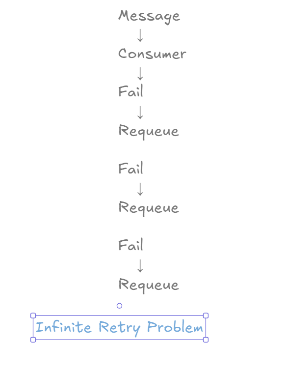

Without a Dead Letter Queue:

```text
Message
   ↓
Consumer
   ↓
Fail
   ↓
Requeue
   ↓
Fail
   ↓
Requeue
```

The message keeps circulating forever.

This wastes:

- CPU
- Memory
- Queue Resources
- Consumer Capacity

---

# Dead Letter Exchange Overview

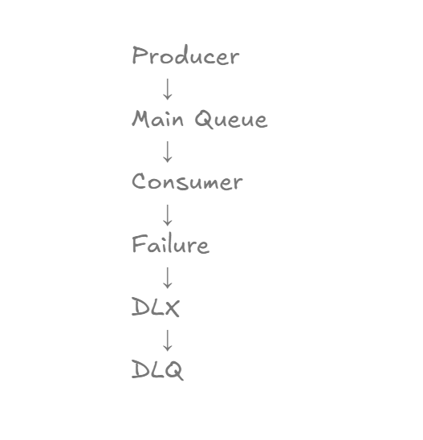

RabbitMQ introduces a special exchange called:

```text
Dead Letter Exchange
```

Flow:

```text
Producer
    ↓
Main Queue
    ↓
Consumer
    ↓
Failure
    ↓
DLX
    ↓
DLQ
```

Instead of endlessly retrying, RabbitMQ safely stores failed messages.

---

# Dead Letter Routing

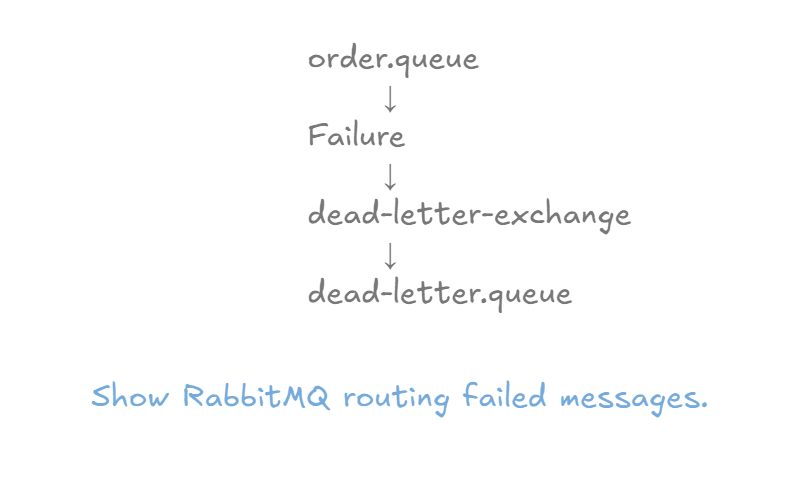

RabbitMQ automatically routes failed messages:

```text
order.queue
      ↓
Failure
      ↓
dead-letter.exchange
      ↓
dead-letter.queue
```

This process is completely automatic once configured.

---

# Poison Messages

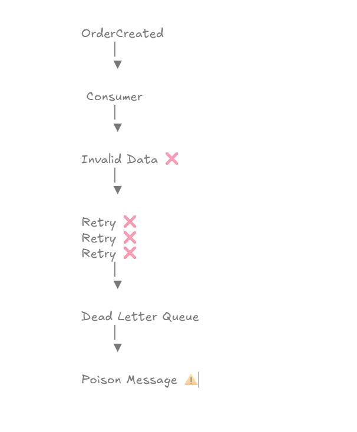

A Poison Message is a message that always fails processing.

Example:

```text
OrderCreated
```

Consumer:

```text
Invalid Data
```

Every retry fails.

RabbitMQ eventually moves the message to:

```text
Dead Letter Queue (DLQ)
```

instead of retrying forever.

---

# Normal Flow vs Dead Letter Flow

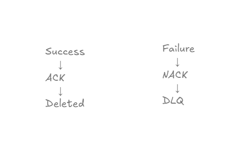

## Successful Message

```text
Message
    ↓
Consumer
    ↓
ACK
    ↓
Deleted
```

---

## Failed Message

```text
Message
    ↓
Consumer
    ↓
Failure
    ↓
DLQ
```

The failed message remains available for investigation.

---

# Real World Example

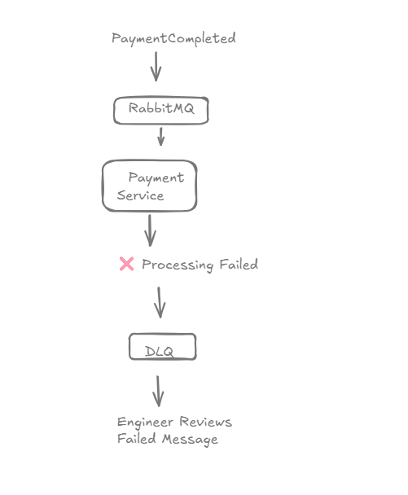

Consider a payment processing system.

Event:

```text
PaymentCompleted
```

Consumer:

```text
Payment Service
```

Problem:

```text
Service Down
```

Instead of losing the payment event:

```text
RabbitMQ
      ↓
Dead Letter Queue
```

The engineering team can later investigate the failure.

---

# Practical Implementation

In this chapter we implemented:

```text
order.queue
```

as the main queue.

And:

```text
dead-letter.queue
```

as the Dead Letter Queue.

Messages rejected by consumers are automatically routed to the DLQ.

---

# Queue Creation

## DLX and DLQ Created

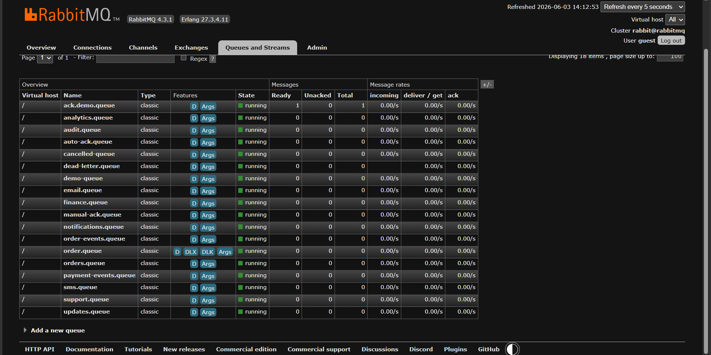

RabbitMQ successfully created:

```text
dead-letter.exchange

dead-letter.queue
```

---

# Main Queue Configuration

## Dead Letter Exchange Configuration

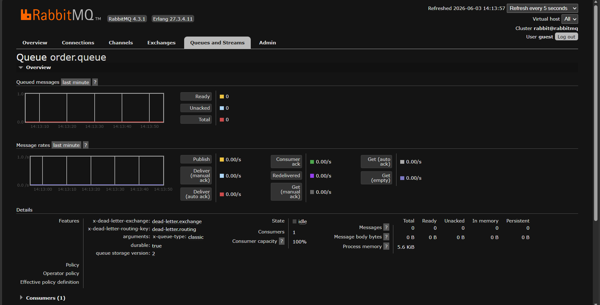

The main queue is configured with:

```text
x-dead-letter-exchange
```

and

```text
x-dead-letter-routing-key
```

This tells RabbitMQ where to send failed messages.

---

# Publishing A Message

Endpoint:

```http
POST /messages/dlq?message=PAYMENT_FAILED
```

---

## Verification

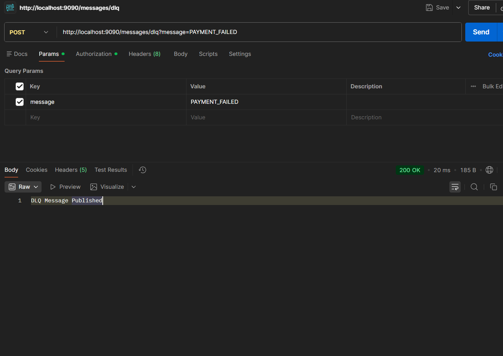

The producer successfully publishes:

```text
PAYMENT_FAILED
```

to RabbitMQ.

---

# Consumer Failure Simulation

The consumer intentionally throws:

```java
throw new RuntimeException(
        "Simulated Failure"
);
```

to demonstrate DLQ behavior.

---

## Verification

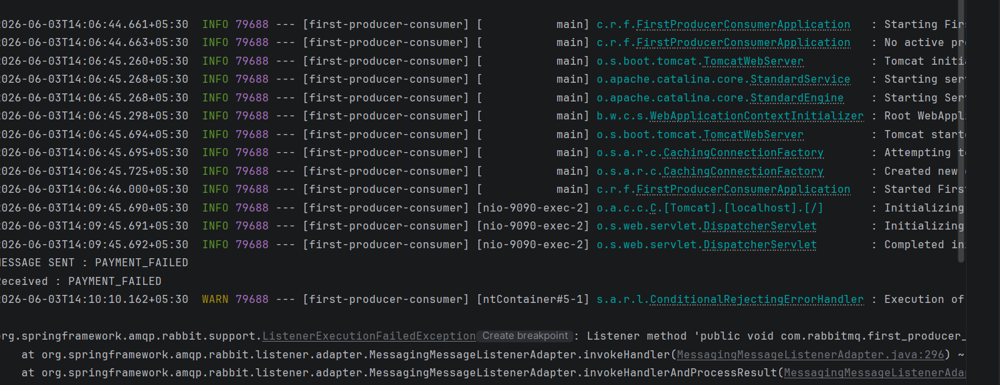

Output:

```text
Received : PAYMENT_FAILED

Simulated Failure
```

This simulates a real production failure.

---

# Message Routed To DLQ

When the consumer fails:

```text
PAYMENT_FAILED
```

RabbitMQ automatically routes the message:

```text
order.queue
      ↓
dead-letter.exchange
      ↓
dead-letter.queue
```

---

## Verification

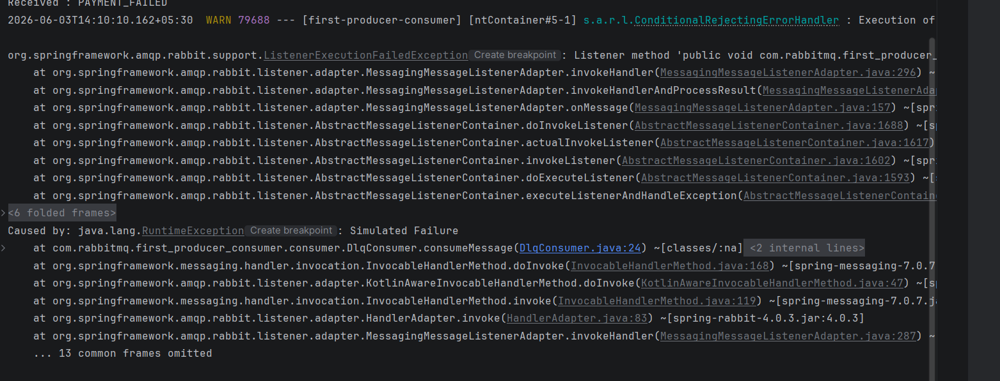

Output:

```text
DEAD LETTER RECEIVED : PAYMENT_FAILED
```

This confirms the message reached the Dead Letter Queue.

---

# Complete DLX Flow

## End-To-End Verification

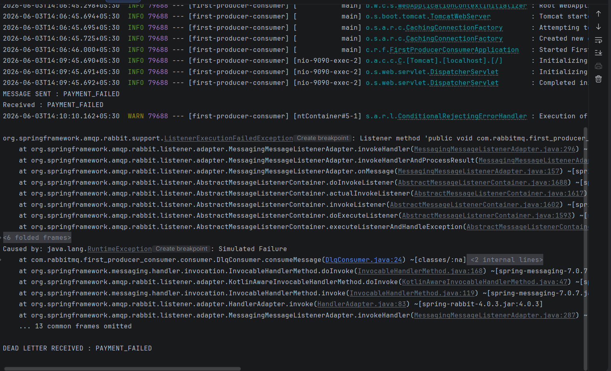

Flow:

```text
MESSAGE SENT : PAYMENT_FAILED

Received : PAYMENT_FAILED

Simulated Failure

DEAD LETTER RECEIVED : PAYMENT_FAILED
```

This proves:

```text
Producer
   ↓
Main Queue
   ↓
Failure
   ↓
Dead Letter Exchange
   ↓
Dead Letter Queue
```

---

# Key Configuration

The most important configuration in this chapter:

```java
QueueBuilder
        .durable(ORDER_QUEUE)
        .deadLetterExchange(DLX_EXCHANGE)
        .deadLetterRoutingKey(DLQ_ROUTING_KEY)
        .build();
```

This enables Dead Letter routing.

---

# Why DLQ Is Important

Without DLQ:

```text
Message Failure
      ↓
Message Lost
```

or

```text
Infinite Retry Loop
```

With DLQ:

```text
Message Failure
      ↓
Dead Letter Queue
      ↓
Investigation
      ↓
Recovery
```

---

# Production Use Cases

## E-Commerce

```text
OrderCreated
```

Inventory Service failure:

```text
Move To DLQ
```

---

## Payments

```text
PaymentCompleted
```

Payment Processor unavailable:

```text
Move To DLQ
```

---

## Banking

```text
MoneyTransferred
```

Database issue:

```text
Move To DLQ
```

---

## Notifications

```text
EmailRequested
```

SMTP unavailable:

```text
Move To DLQ
```

---

# Production Best Practices

## Never Ignore Failed Messages

Always capture failed messages.

---

## Monitor Dead Letter Queues

A growing DLQ usually indicates:

- Application bugs
- Infrastructure failures
- External dependency issues

---

## Investigate Poison Messages

Poison Messages often reveal:

- Invalid payloads
- Data corruption
- Validation errors

---

## Use DLQ With Retry Strategies

A typical production flow:

```text
Retry
Retry
Retry
 ↓
DLQ
```

We will implement this in the next chapter.

---

# Interview Questions

1. What is a Dead Letter Exchange?
2. What is a Dead Letter Queue?
3. What is a Poison Message?
4. Why do we need DLQ?
5. What is `x-dead-letter-exchange`?
6. What is `x-dead-letter-routing-key`?
7. What happens when a consumer rejects a message?
8. How does RabbitMQ route dead letters?
9. What are common DLQ use cases?
10. How do production systems use DLQs?

---

# Key Takeaways

- DLX stands for Dead Letter Exchange.
- DLQ stands for Dead Letter Queue.
- Failed messages can be routed automatically.
- Poison Messages should be isolated.
- DLQs prevent infinite retry loops.
- DLQs improve reliability and debugging.
- Every production RabbitMQ system should use DLQs.

---

# Chapter Summary

In this chapter, we implemented:

```text
Dead Letter Exchange
        +
Dead Letter Queue
```

We learned:

- Dead Letter Routing
- Poison Messages
- DLQ Configuration
- Failure Isolation
- Production Recovery Patterns

Most importantly:

```text
Consumer Failure
        ↓
DLX
        ↓
DLQ
        ↓
Investigation
```

This pattern is widely used in enterprise event-driven systems.

---

# What's Next?

## Chapter 18 → Retry Mechanisms

Topics Covered:

- Retry Queues
- Retry Limits
- Delayed Retries
- Retry Count Tracking
- DLQ Integration
- Production Retry Strategies

In the next chapter, we will build a complete retry mechanism before sending messages to the Dead Letter Queue.