# Publisher Confirms

## Learning Objectives

After completing this chapter, you will understand:

- What Publisher Confirms are
- Why Producer Reliability is important
- How RabbitMQ acknowledges published messages
- Broker ACK vs Broker NACK
- How ConfirmCallback works
- How to enable Publisher Confirms in Spring Boot
- Production-grade publishing patterns
- Preventing silent message loss

---

# The Producer Reliability Problem

So far we have focused on:

```text
Queues
Exchanges
Bindings
Routing Keys
ACKs
NACKs
DLQ
DLX
```

All of these concepts protect messages **after RabbitMQ receives them**.

But an important question remains:

```text
How does the Producer know
RabbitMQ actually received the message?
```

Without Publisher Confirms:

```text
Producer
     ↓
Send Message
     ↓
Network Failure?
     ↓
Unknown
```

The producer has no guarantee that RabbitMQ successfully accepted the message.

---

# Why Publisher Confirms Exist

Publisher Confirms provide:

```text
Producer
      ↓
RabbitMQ
      ↓
ACK / NACK
```

The broker explicitly tells the producer whether the message was accepted.

This eliminates uncertainty and improves reliability.

---

# Publisher Confirm Problem

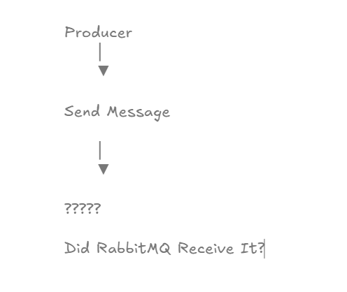

Without confirmation:

```text
Producer
      ↓
Send Message
      ↓
?????
```

Questions:

```text
Did RabbitMQ receive it?

Was the message stored?

Was the broker available?
```

The producer does not know.

---

# Publisher Confirm Overview

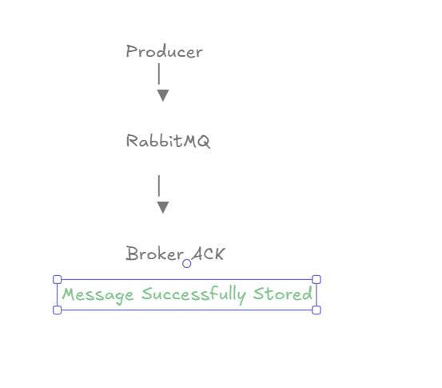

RabbitMQ introduces:

```text
Publisher Confirms
```

Flow:

```text
Producer
      ↓
RabbitMQ
      ↓
ACK
```

The broker explicitly confirms successful receipt.

---

# Broker ACK Flow

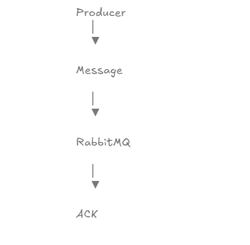

Successful publishing:

```text
Producer
      ↓
Message
      ↓
RabbitMQ
      ↓
ACK
```

Result:

```text
Message Successfully Accepted
```

---

# Broker NACK Flow

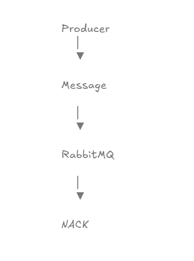

Failure scenario:

```text
Producer
      ↓
Message
      ↓
RabbitMQ
      ↓
NACK
```

Result:

```text
Publishing Failed
```

The producer can retry or log the failure.

---

# With vs Without Publisher Confirms

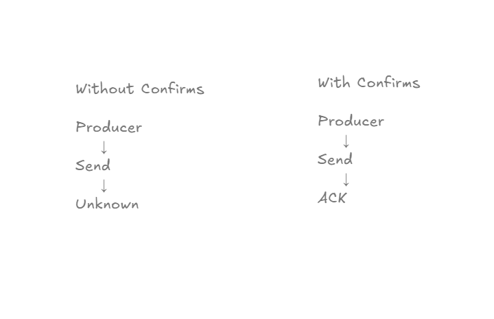

## Without Confirms

```text
Producer
      ↓
Send
      ↓
Unknown Result
```

---

## With Confirms

```text
Producer
      ↓
Send
      ↓
ACK
```

The producer knows the message was accepted.

---

# Real World Example

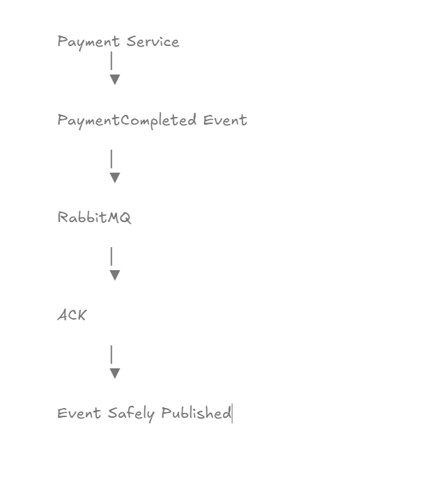

Consider a payment system.

Event:

```text
PaymentCompleted
```

The producer publishes:

```text
PAYMENT_COMPLETED
```

RabbitMQ responds:

```text
ACK
```

Result:

```text
Event Successfully Stored
```

This prevents silent message loss.

---

# Practical Implementation

In this chapter we implemented:

```text
Publisher Confirm Callback
```

using:

```java
RabbitTemplate
```

and:

```java
ConfirmCallback
```

to receive broker acknowledgements.

---

# Enabling Publisher Confirms

Spring Boot configuration:

```properties
spring.rabbitmq.publisher-confirm-type=correlated
```

---

## Verification

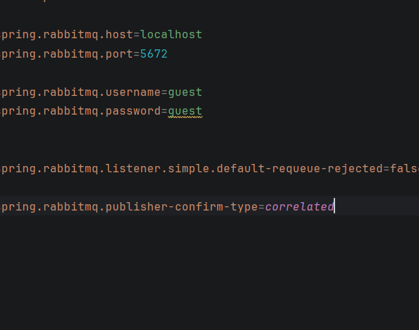

This enables RabbitMQ Publisher Confirm functionality.

---

# Confirm Callback Configuration

RabbitMQ sends:

```text
ACK
```

or

```text
NACK
```

back to the producer.

---

## Verification

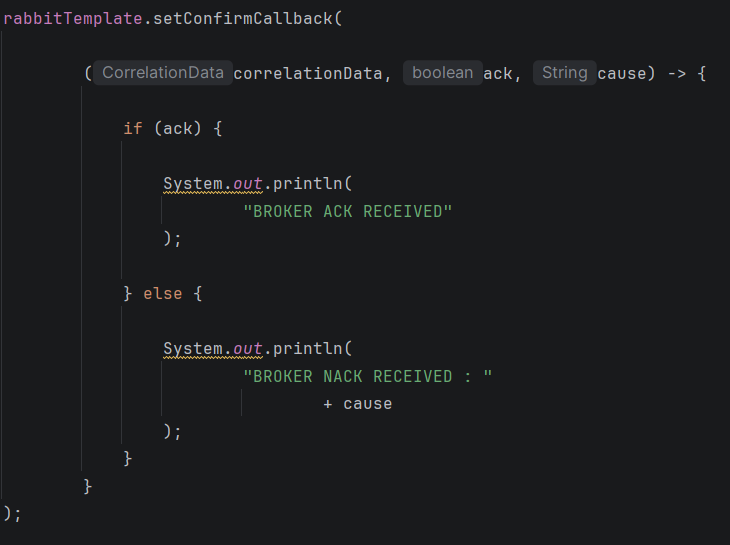

Core implementation:

```java
rabbitTemplate.setConfirmCallback(
    (correlationData, ack, cause) -> {

        if (ack) {

            System.out.println(
                    "BROKER ACK RECEIVED"
            );

        } else {

            System.out.println(
                    "BROKER NACK RECEIVED"
            );
        }
    }
);
```

This callback is executed whenever RabbitMQ responds.

---

# Publishing A Message

Endpoint:

```http
POST /messages/publisher-confirm?message=PAYMENT_COMPLETED
```

---

## Verification

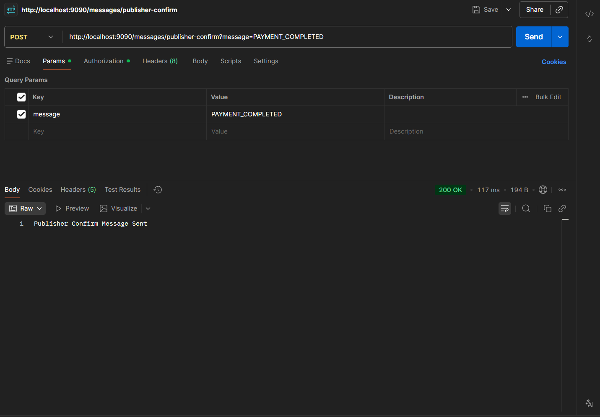

The producer successfully publishes:

```text
PAYMENT_COMPLETED
```

to RabbitMQ.

---

# Broker Acknowledgement

RabbitMQ receives the message and confirms successful publishing.

---

## Verification

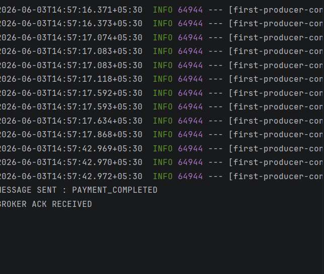

Console Output:

```text
MESSAGE SENT : PAYMENT_COMPLETED

BROKER ACK RECEIVED
```

This confirms the broker accepted the message.

---

# Complete Publisher Confirm Flow

## End-To-End Verification

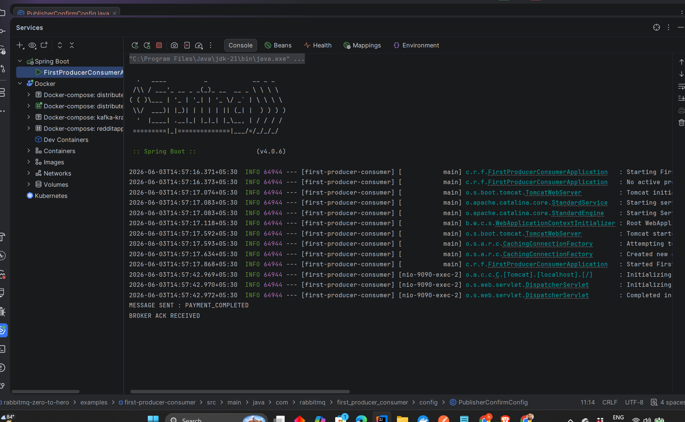

Flow:

```text
Producer
      ↓
Publish Message
      ↓
RabbitMQ
      ↓
Broker ACK
```

Result:

```text
Message Safely Published
```

---

# RabbitMQ Connection Verification

RabbitMQ maintains an active connection with the producer application.

---

## Verification

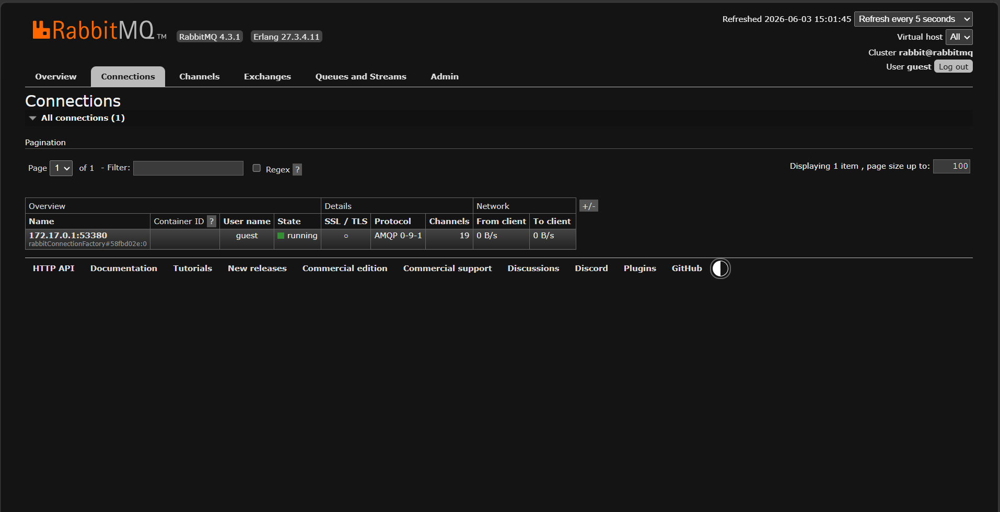

This confirms the application is connected to RabbitMQ and capable of receiving publisher confirmations.

---

# ACK vs NACK

| Response | Meaning |
|-----------|-----------|
| ACK | RabbitMQ accepted the message |
| NACK | RabbitMQ rejected the message |
| No Response | Potential connection issue |

---

# Why Publisher Confirms Matter

Without confirms:

```text
Message Sent
      ↓
Network Failure
      ↓
Unknown Status
```

Producer cannot determine whether RabbitMQ received the message.

---

With confirms:

```text
Message Sent
      ↓
RabbitMQ
      ↓
ACK
```

Producer knows the message is safely stored.

---

# Production Use Cases

## Payments

```text
PaymentCompleted
```

Requires guaranteed publishing.

---

## Banking

```text
MoneyTransferred
```

Cannot tolerate silent message loss.

---

## Order Processing

```text
OrderCreated
```

Must be reliably published.

---

## Inventory Management

```text
StockUpdated
```

Requires producer confirmation.

---

# Production Best Practices

## Always Enable Publisher Confirms

Critical systems should never publish blindly.

---

## Log NACK Responses

Always capture:

```text
BROKER NACK RECEIVED
```

for investigation.

---

## Combine With Durable Queues

Publisher Confirms and durable queues provide stronger reliability guarantees.

---

## Combine With DLQ

A production architecture often uses:

```text
Publisher Confirm
       +
DLQ
       +
Retries
```

for maximum resilience.

---

# Interview Questions

1. What are Publisher Confirms?
2. Why do we need Publisher Confirms?
3. What is a Broker ACK?
4. What is a Broker NACK?
5. What is ConfirmCallback?
6. How do you enable Publisher Confirms in Spring Boot?
7. What happens if RabbitMQ rejects a message?
8. What is the difference between Consumer ACK and Publisher Confirm?
9. Why are Publisher Confirms important in production?
10. How do Publisher Confirms improve reliability?

---

# Key Takeaways

- Publisher Confirms provide producer-side reliability.
- RabbitMQ explicitly acknowledges published messages.
- ACK indicates successful publishing.
- NACK indicates publishing failure.
- ConfirmCallback handles broker responses.
- Publisher Confirms prevent silent message loss.
- Every production RabbitMQ application should use Publisher Confirms.

---

# Chapter Summary

In this chapter, we implemented:

```text
Publisher Confirms
```

to ensure producers know when RabbitMQ successfully receives messages.

We learned:

- Producer Reliability
- Broker ACK
- Broker NACK
- ConfirmCallback
- Spring Boot Configuration
- Production Publishing Patterns

Most importantly:

```text
Producer
      ↓
Publish Message
      ↓
RabbitMQ
      ↓
ACK
      ↓
Success
```

This completes the producer-side reliability journey in RabbitMQ.

---

# What's Next?

## Chapter 19 → Message Persistence & Durable Messaging

Topics Covered:

- Durable Queues
- Persistent Messages
- Broker Restart Recovery
- Message Survival
- Durable vs Non-Durable Messaging
- Production Reliability Guarantees

In the next chapter, we will ensure messages survive RabbitMQ restarts.