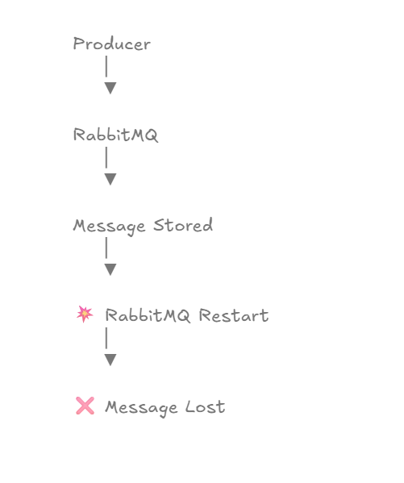
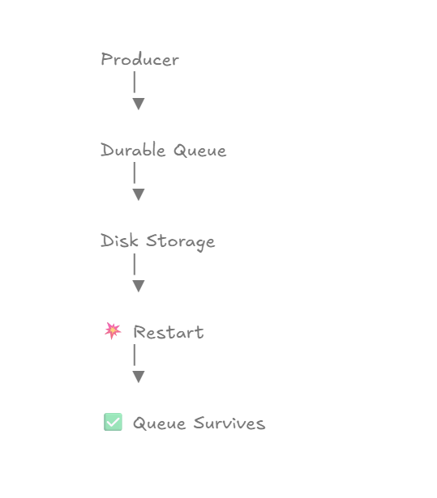
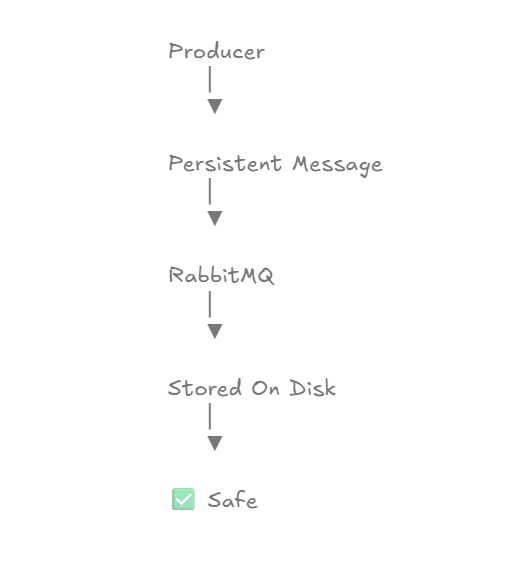
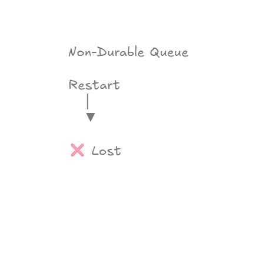
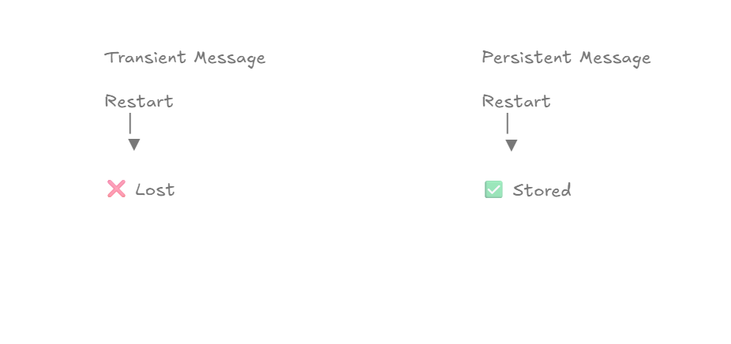
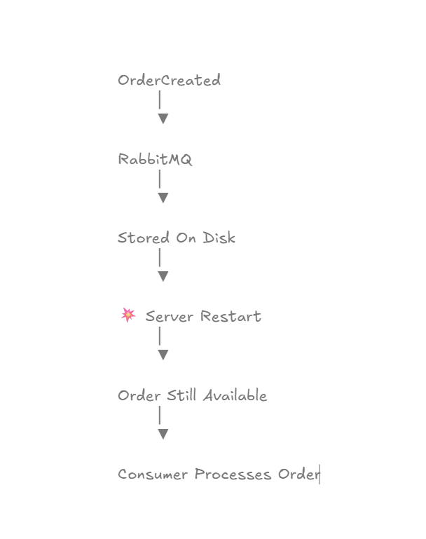

# Message Persistence & Durable Messaging

## Learning Objectives

After completing this chapter, you will understand:

* What Message Persistence is
* What Durable Queues are
* What Persistent Messages are
* Difference between Durable and Non-Durable Queues
* Difference between Persistent and Transient Messages
* How RabbitMQ survives broker restarts
* Why production systems use durable messaging
* How to configure persistence in Spring Boot

---

# Why Message Persistence Matters

Imagine the following scenario:

```text
Producer
    ↓
RabbitMQ
    ↓
Message Stored
```

Everything looks fine.

But suddenly:

```text
RabbitMQ Server Restart
```

What happens to the message?

The answer depends on how the queue and message were configured.

Without durability and persistence:

```text
Restart
   ↓
Message Lost 
```

With durability and persistence:

```text
Restart
   ↓
Message Survives 
```

This is one of the most important reliability features in RabbitMQ.

---

# The Message Loss Problem



Without persistence:

```text
Producer
    ↓
Queue
    ↓
RabbitMQ Restart
    ↓
Message Lost
```

This can result in:

* Lost orders
* Lost payments
* Lost notifications
* Lost business events

Production systems cannot tolerate this.

---

# Durable Queue Overview



A Durable Queue survives broker restarts.

RabbitMQ stores queue metadata on disk.

Flow:

```text
Producer
    ↓
Durable Queue
    ↓
Disk Storage
    ↓
Broker Restart
    ↓
Queue Survives
```

---

# Persistent Message Flow



Persistent messages are written to disk.

Flow:

```text
Producer
    ↓
Persistent Message
    ↓
RabbitMQ
    ↓
Stored On Disk
```

Result:

```text
Message Safe
```

Even if RabbitMQ restarts, the message can still be recovered.

---

# Durable vs Non-Durable Queues



## Non-Durable Queue

```text
Restart
   ↓
Queue Lost
```

RabbitMQ removes the queue after restart.

---

## Durable Queue

```text
Restart
   ↓
Queue Survives
```

RabbitMQ recreates the queue automatically after restart.

---

# Persistent vs Transient Messages



## Transient Message

```text
Restart
   ↓
Message Lost
```

Message exists only in memory.

---

## Persistent Message

```text
Restart
   ↓
Message Recovered
```

Message is stored on disk.

---

# Real World Example



Consider an e-commerce platform.

Event:

```text
OrderCreated
```

The order event is published to RabbitMQ.

Suddenly:

```text
RabbitMQ Server Restart
```

Without persistence:

```text
Order Lost
```

With persistence:

```text
Order Still Available
```

The consumer can continue processing after the broker restarts.

---

# Durable Queue Configuration

In this chapter we created a durable queue.

Example:

```java
QueueBuilder
        .durable("durable-order.queue")
        .build();
```

The durable queue definition is stored by RabbitMQ and survives restarts.

---

# Persistent Message Configuration

Messages were published using:

```java
MessageDeliveryMode.PERSISTENT
```

Example:

```java
msg.getMessageProperties()
        .setDeliveryMode(
                MessageDeliveryMode.PERSISTENT
        );
```

This instructs RabbitMQ to persist the message.

---

# Durable Queue + Persistent Message

For true durability, both are required.

## Only Durable Queue

```text
Queue Survives
Message May Be Lost
```

---

## Only Persistent Message

```text
Message Persistent
Queue Missing
```

---

## Durable Queue + Persistent Message

```text
Queue Survives
Message Survives
```

This is the recommended production configuration.

---

# Reliability Flow

```text
Producer
    ↓
Persistent Message
    ↓
Durable Queue
    ↓
Disk Storage
    ↓
Broker Restart
    ↓
Message Recovered
```

This is the foundation of reliable messaging systems.

---

# Production Use Cases

## E-Commerce

```text
OrderCreated
OrderCancelled
OrderShipped
```

Must survive failures.

---

## Banking

```text
MoneyTransferred
PaymentCompleted
```

Cannot be lost.

---

## Inventory Systems

```text
StockUpdated
```

Must remain consistent.

---

## Notification Systems

```text
EmailRequested
SMSRequested
```

Should survive broker restarts.

---

# Best Practices

## Always Use Durable Queues

Avoid non-durable queues in production.

---

## Use Persistent Messages

Critical business events should always be persistent.

---

## Combine With Publisher Confirms

Publisher Confirms ensure RabbitMQ receives the message.

Persistence ensures RabbitMQ keeps the message.

---

## Combine With DLQ

Persistent messages should still use:

```text
DLQ
Retries
Acknowledgements
```

for maximum reliability.

---

# Common Misconception

Many developers believe:

```text
Durable Queue
```

automatically means:

```text
Persistent Message
```

This is incorrect.

Both configurations are required.

---

# Interview Questions

1. What is a Durable Queue?
2. What is a Persistent Message?
3. What is the difference between Durable and Non-Durable Queues?
4. What is the difference between Persistent and Transient Messages?
5. Does a Durable Queue guarantee message survival?
6. Why do we use MessageDeliveryMode.PERSISTENT?
7. What happens when RabbitMQ restarts?
8. Can a Persistent Message survive in a Non-Durable Queue?
9. Why is durability important in production?
10. What is the recommended RabbitMQ durability configuration?

---

# Key Takeaways

* Durable Queues survive broker restarts.
* Persistent Messages are stored on disk.
* Durable Queue ≠ Persistent Message.
* Both are required for reliable message recovery.
* Persistence prevents message loss.
* Production RabbitMQ systems should use durable messaging.
* Durability is a core reliability feature.

---

# Chapter Summary

In this chapter, we implemented:

```text
Durable Queue
        +
Persistent Message
```

We learned:

* Queue Durability
* Message Persistence
* Restart Recovery
* Message Survival
* Production Reliability

Most importantly:

```text
Producer
      ↓
Persistent Message
      ↓
Durable Queue
      ↓
RabbitMQ Restart
      ↓
Message Survives
```

This completes another major reliability pillar of RabbitMQ.

---

# What's Next?

## Chapter 20 → Retry Mechanisms

Topics Covered:

* Retry Queues
* Retry Limits
* Delayed Retries
* Retry Count Tracking
* DLQ Integration
* Production Retry Strategies

In the next chapter, we will build a production-grade retry mechanism before sending failed messages to the Dead Letter Queue.
